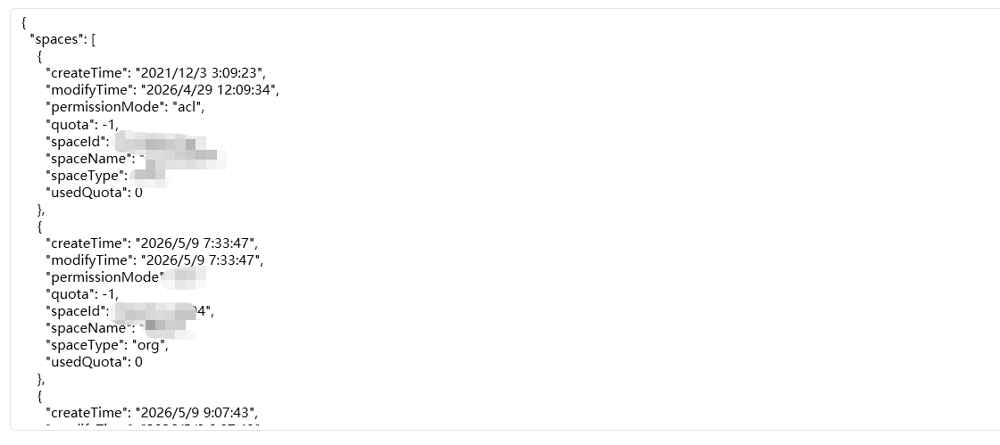

## <strong>一、指令概述</strong>

该指令用于调用钉钉开放平台接口，<strong>查询指定用户的钉盘存储空间列表</strong>，获取每个空间对应的唯一 space_id，space_id 是后续所有钉盘操作（查询文件、创建文件夹、上传文件等）的核心前置参数，为钉盘自动化流程的基础指令。

可查看官方文档： https://open.dingtalk.com/document/development/queries-a-space-list[https://open.dingtalk.com/document/development/queries-a-space-list](https://open.dingtalk.com/document/development/queries-a-space-list)
## <strong>二、核心参数配置</strong>参数名称说明输入格式 / 规则凭证钉钉开放平台接口调用凭证（access_token）必填；通过「获取开发平台凭证」指令获取用户 union id钉钉用户唯一 unionId必填；通过「获取用户详情信息」指令获取，为一串随机字母数字next_token分页查询标识选填；首次查询留空；分页时传入上一轮返回的next_token获取下一页生成变量【获取到空间列表】存储查询结果的输出变量必填；返回字典格式，包含空间 ID、空间名称等核心信息
## <strong>三、典型操作示例</strong>

· 凭证：ding_access_token_xxxx

· 用户 union id：xxxxxxx

· next_token：（留空）

· 输出变量：ding_space_list

· 执行效果：返回该用户名下所有钉盘空间信息，包含space_id、空间名称、空间类型等。

输出结果：

权限：

<Info>
  使用指令过程中遇到问题？前往 [八爪鱼RPA 开发者社区问答板块](https://rpa.bazhuayu.com/community/questions) 提问，获取官方与社区帮助。
</Info>
