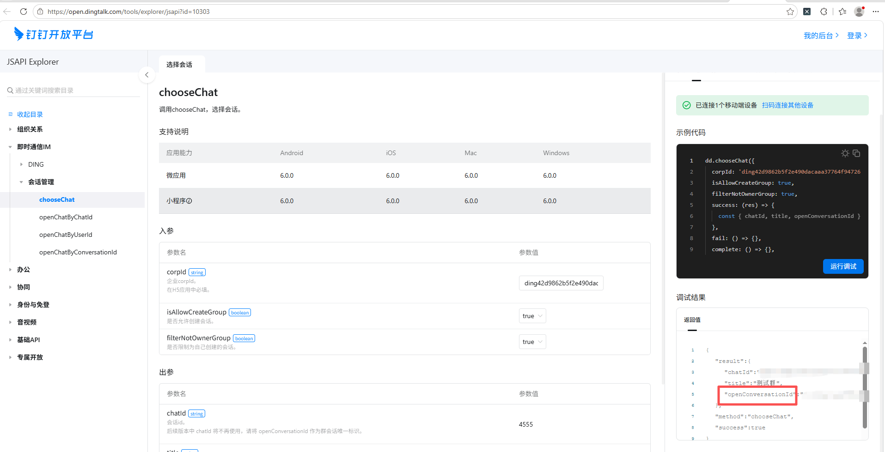

## 一、指令概述

用于将本地文件上传至钉钉指定文件夹，并发送到目标钉钉群聊，适用于批量文件分发、群内资料同步等场景，可提升文件共享的效率与规范性。
## 二、调用参数配置参数名称配置说明约束规则凭证钉钉开放平台访问凭证，用于接口身份认证必填；可通过 “获取开发平台凭证” 指令获取，需确保凭证在有效期内文件待发送的本地文件，可通过 “选择文件” 按钮选取或输入文件绝对路径必填；需确保文件存在且具备读取权限用户 Id操作发起者的用户 ID，为一串数字必填；可通过 “查询用户 Id” 指令获取，或在钉钉管理后台 “通讯录 - 成员管理” 模块获取文件夹 Id文件上传的目标钉钉存储文件夹 ID，0 表示用户存储空间根目录必填；可通过 “获取钉钉存储的文件夹列表” 指令获取群对话 Id目标群聊的conversation_id必填；可在钉钉开放平台https://open.dingtalk.com/tools/explorer/jsapi?id=10303页面获取生成变量返回一个字典
## 三、输出说明
## 四、典型操作示例
示例 1：发送本地报表到部门群配置 “凭证”：通过 “获取开发平台凭证” 指令获取并填入有效凭证；配置 “文件”：点击 “选择文件” 按钮，选取本地文件D:\部门报表.xlsx；配置 “用户 Id”：填入当前操作账号的用户 Id（如123456）；配置 “文件夹 Id”：填入目标文件夹 Id（如0，表示根目录）；配置 “群对话 Id”：填入部门群的conversation_id（如cid_xxxx）；执行指令后，文件将上传至钉钉存储并发送到目标群聊，输出结果对象包含上传与发送状态。

六、注意事项<strong>参数配置约束</strong>：所有参数均为必填项，需确保格式与来源准确；凭证过期需重新获取，群对话 Id 需与目标群聊完全匹配；<strong>权限相关</strong>：若提示 “无权限”，需检查账号的群聊发送权限、文件夹上传权限，或联系管理员配置钉钉开放平台接口权限；<strong>操作权限</strong>：需具备钉钉开放平台接口调用权限，且用户 Id 对应的账号需拥有目标群聊的发送权限、目标文件夹的上传权限；
#### 群对话Id的获取操作过程：

打开链接： 获取群聊id链接[获取群聊id链接](https://open.dingtalk.com/tools/explorer/jsapi?id=10303 )

点击chooseChat 填写Corpid，然后连接PC设备进行调试就可以知道指定群的id了，chatid就是那个群聊id

<Info>
  使用指令过程中遇到问题？前往 [八爪鱼RPA 开发者社区问答板块](https://rpa.bazhuayu.com/community/questions) 提问，获取官方与社区帮助。
</Info>
