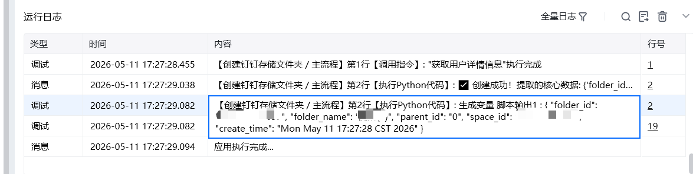

## <strong>一、指令概述</strong>

该指令用于在钉钉钉盘<strong>指定目录下创建文件夹</strong>，支持自定义文件夹名称与应用属性；若同名文件夹已存在，直接返回已有文件夹 ID，避免重复创建，适用于钉盘目录初始化、自动归档、业务文件夹批量搭建等自动化场景。

可查看官方文档： https://open.dingtalk.com/document/development/add-folder[https://open.dingtalk.com/document/development/add-folder](https://open.dingtalk.com/document/development/add-folder)
## <strong>二、核心参数配置</strong>参数名称说明输入格式 / 规则凭证钉钉开放平台接口调用凭证（access_token）必填；通过「获取开发平台凭证」指令获取用户 Id操作人的钉钉用户 ID必填；可通过「查询用户 Id」指令获取space_id钉盘空间 ID必填；通过「获取空间列表」指令获取，指定目标钉盘空间父目录 Id目标父目录 ID必填；0代表用户空间根目录，填写具体 ID 则在对应子目录下创建文件夹名称待创建的文件夹名称必填；自定义合法文件夹名，支持中文、数字、英文应用属性名称自定义扩展属性名选填；用于给文件夹添加业务自定义标签应用属性值自定义扩展属性值选填；与应用属性名称配对使用生成变量【文件夹 Id】存储结果的输出变量必填；返回文件夹唯一 ID，新建 / 已存在均返回有效 ID
## <strong>三、典型操作示例</strong>

· 凭证：ding_access_token_xxxx

· 用户 Id：m4PgPMMZNiijuStvkgQD2VAiEiE

· space_id：28821244xxx

· 父目录 Id：0

· 文件夹名称：2026年业务归档

· 应用属性名称：业务类型

· 应用属性值：销售数据

· 输出变量：new_folder_id

· 执行效果：在钉盘根目录创建2026年业务归档文件夹，自动添加自定义业务标签；若已存在，直接返回已有文件夹 ID。

输出结果：

## <strong>五、注意事项</strong>

1. <strong>权限校验</strong>：操作人必须拥有目标钉盘、父目录的<strong>创建权限</strong>，否则创建失败；

<Info>
  使用指令过程中遇到问题？前往 [八爪鱼RPA 开发者社区问答板块](https://rpa.bazhuayu.com/community/questions) 提问，获取官方与社区帮助。
</Info>
