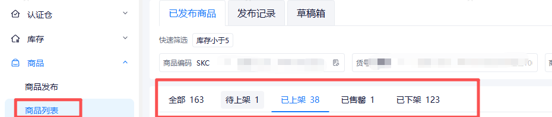
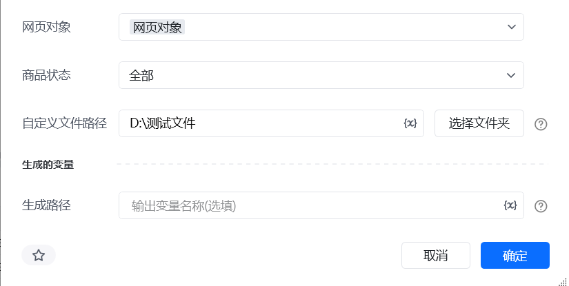
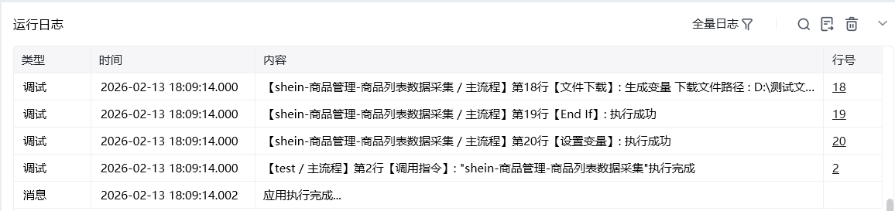

## 一、指令概述

该指令为企业版专享功能，用于自动采集 Shein 店铺的商品列表数据，并保存为本地文件，支持按商品状态筛选，可替代人工手动导出操作。

## 二、调用参数配置参数名称配置说明约束规则网页对象已登录 Shein 商家后台商品管理模块的网页对象（用于执行采集操作）必填；需为有效的浏览器网页对象商品状态筛选商品的状态，可选：全部、待上架、已上架、已售罄、已下架必填；决定采集商品的范围自定义文件路径采集文件保存的本地文件夹路径（可点击 “选择文件夹” 配置）必填；需为本地可访问的文件夹路径自定义文件名称保存文件的名称（不含后缀，如 “2025-01 商品列表”）选填；留空则使用系统默认文件名，填写时无需加后缀发布开始时间格式：YYYY-MM-DD选填；发布结束时间格式：YYYY-MM-DD选填；时间跨度最大一个月生成的变量存储文件生成路径的变量名称必填；用于承接输出结果，供下游指令调用
## 三、输出说明

## 四、典型操作示例

<Info>
  使用指令过程中遇到问题？前往 [八爪鱼RPA 开发者社区问答板块](https://rpa.bazhuayu.com/community/questions) 提问，获取官方与社区帮助。
</Info>
