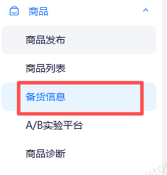
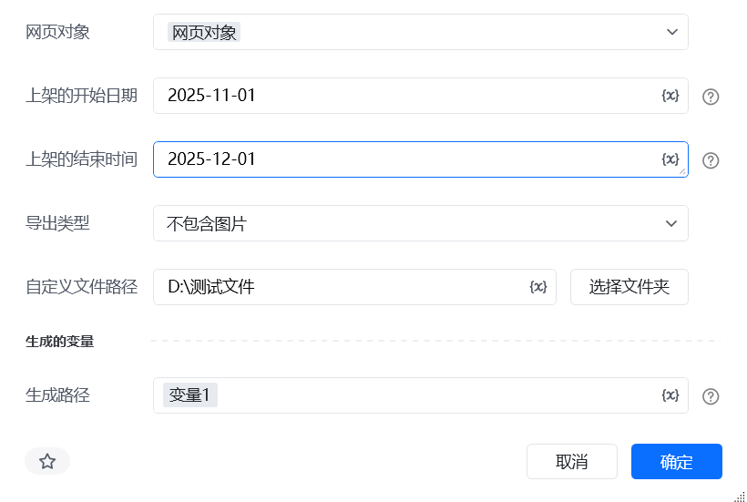
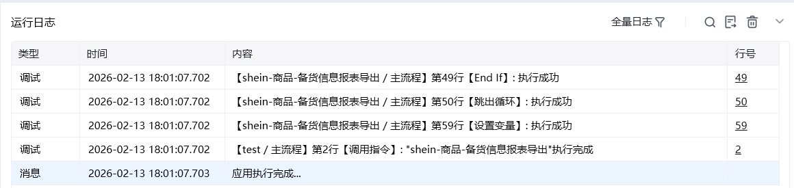

## 一、指令概述

该指令为企业版专享功能，用于自动导出 Shein 店铺的商品备货信息报表，支持按上架日期、上架状态、供应状态、建议状态等多维度筛选，并可自定义文件保存路径与名称。

## 二、调用参数配置参数名称配置说明约束规则网页对象已登录 Shein 商家后台商品模块的网页对象（用于执行导出操作）必填；需为有效的浏览器网页对象上架的开始日期商品上架的起始日期，格式：YYYY-MM-DD必填；需早于或等于上架的结束时间上架的结束时间商品上架的结束日期，格式：YYYY-MM-DD必填；需晚于或等于上架的开始日期导出类型报表是否包含商品图片，可选：不包含图片、包含图片必填；“包含图片” 会增大文件体积，下载耗时更长自定义文件路径报表保存的本地文件夹路径（可点击 “选择文件夹” 配置）必填；需为本地可访问的文件夹路径上架状态筛选商品的上架状态，可选：已上架、已下架、待上架选填；留空则默认导出全部状态供应状态筛选商品的供应状态，可选：正常供货、停产选填；留空则默认导出全部状态建议状态筛选商品的备货建议状态，可选：待处理、已下单选填；留空则默认导出全部状态自定义文件名称保存文件的名称（不含后缀，如 “2025-01 备货报表”）选填；留空则使用系统默认文件名，填写时无需加后缀生成的变量存储文件生成路径的变量名称必填；用于承接输出结果，供下游指令调用
## 三、输出说明

## 四、典型操作示例

<Info>
  使用指令过程中遇到问题？前往 [八爪鱼RPA 开发者社区问答板块](https://rpa.bazhuayu.com/community/questions) 提问，获取官方与社区帮助。
</Info>
