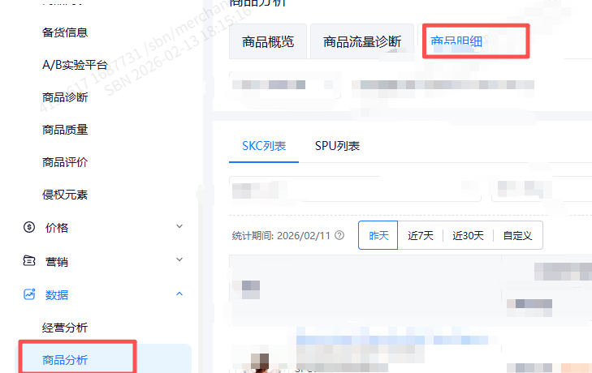
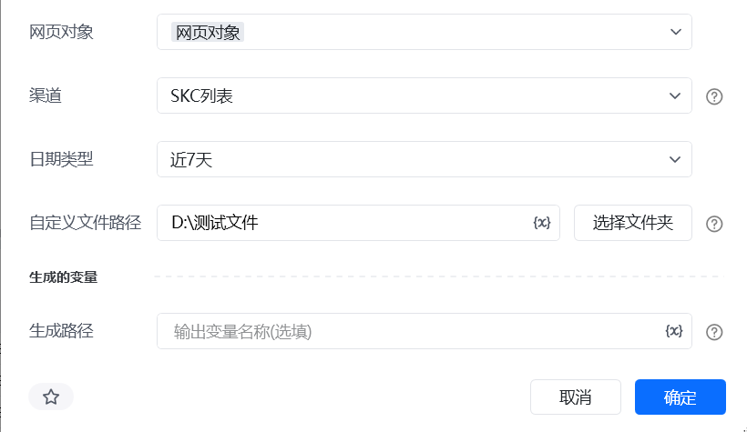
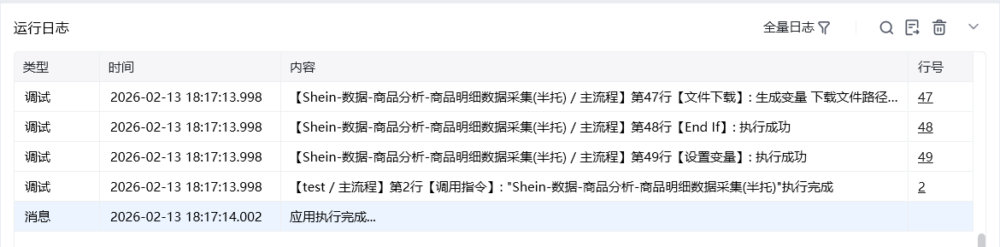

## 一、指令概述

该指令为企业版专享功能，用于自动采集 Shein 店铺商品分析模块的商品明细数据，支持按渠道、日期范围、在架状态、在售状态等多维度筛选，并可自定义文件保存路径与名称，可替代人工手动导出操作。

## 二、调用参数配置参数名称配置说明约束规则网页对象已登录 Shein 商家后台商品分析模块的网页对象（用于执行采集操作）必填；需为有效的浏览器网页对象渠道采集数据的渠道，可选：SKC 列表、SPU 列表必填；决定采集的商品维度日期类型日期范围类型，可选：昨天、近 7 天、近 30 天、自定义必填；若选择 “自定义”，需配置开始日期和结束日期开始日期数据统计的起始日期，格式：YYYY-MM-DD条件必填；仅当日期类型为 “自定义” 时需配置，需早于或等于结束日期结束日期数据统计的结束日期，格式：YYYY-MM-DD条件必填；仅当日期类型为 “自定义” 时需配置，需晚于或等于开始日期自定义文件路径采集文件保存的本地文件夹路径（可点击 “选择文件夹” 配置）必填；需为本地可访问的文件夹路径在架状态筛选商品的在架状态，可选：上架、下架选填；留空则默认导出全部状态在售状态筛选商品的在售状态，可选：在售、非在售选填；留空则默认导出全部状态自定义文件名称保存文件的名称（不含后缀，如 “2025-01 商品明细”）选填；留空则使用系统默认文件名，填写时无需加后缀生成的变量存储文件生成路径的变量名称必填；用于承接输出结果，供下游指令调用
## 三、输出说明

## 四、典型操作示例

<Info>
  使用指令过程中遇到问题？前往 [八爪鱼RPA 开发者社区问答板块](https://rpa.bazhuayu.com/community/questions) 提问，获取官方与社区帮助。
</Info>
