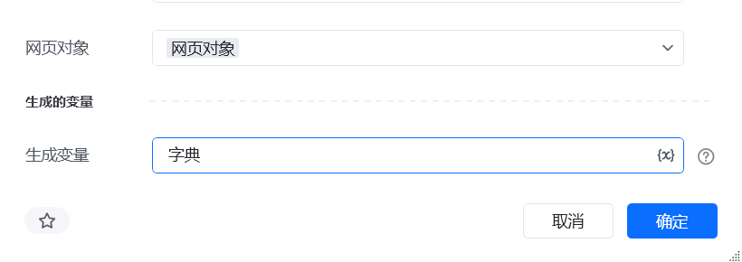

## 一、指令概述

该指令为企业版专享功能，用于自动采集 Shein 商家钱包中的<strong>可提现金额、提现中的金额、不可提现金额</strong>数据，适用于资金监控、对账统计等场景，可替代人工手动查看与记录操作。

## 二、调用参数配置参数名称配置说明约束规则网页对象已登录 Shein 商家后台财务模块的网页对象（用于执行数据采集）必填；打开对应的浏览器网页对象，生成的变量存储采集到的钱包数据的变量名称必填；用于承接输出结果，供下游指令调用
## 三、输出说明

\{ "可提现金额": "12500.00", "提现中金额": "3200.00","不可提现金额":"100" \}
## 四、典型操作示例

<Info>
  使用指令过程中遇到问题？前往 [八爪鱼RPA 开发者社区问答板块](https://rpa.bazhuayu.com/community/questions) 提问，获取官方与社区帮助。
</Info>
