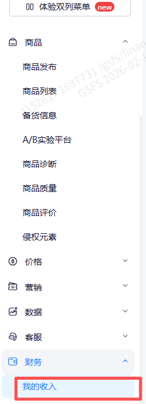
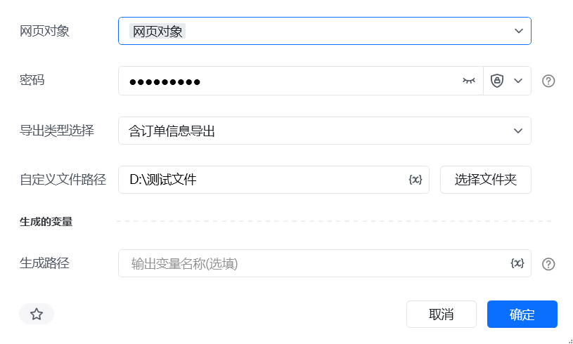
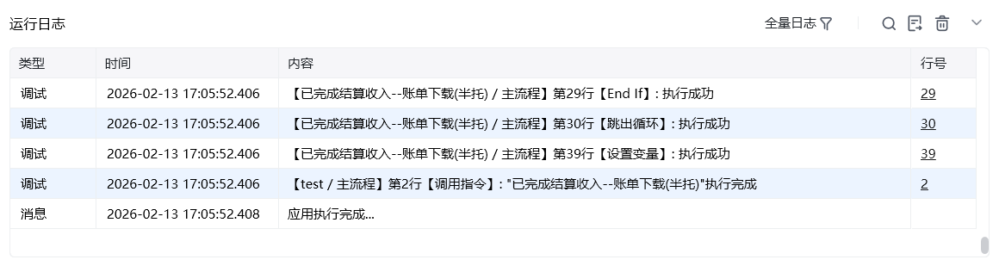

## 一、指令概述

该指令为企业版专享功能，用于自动下载「财务 - 我的收入 - 在途订单」报表，支持按日期范围、导出类型筛选，并可自定义文件保存路径与名称，适用于财务对账、数据归档等场景，可替代人工手动下载操作。

## 二、调用参数配置参数名称配置说明约束规则网页对象已登录财务系统的网页对象（用于执行下载操作）必填；需为有效的浏览器网页对象，且已完成登录密码财务二次验证密码（若系统要求）选填；若系统无二次验证可留空开始日期报表统计的起始日期，格式：YYYY-MM-DD必填；需早于或等于结束日期结束日期报表统计的结束日期，格式：YYYY-MM-DD必填；需晚于或等于开始日期导出类型选择报表导出的详细程度，可选：1. 含订单信息导出2. 含订单及详细商品导出必填；需与系统支持的导出类型一致自定义文件路径报表保存的本地文件夹路径（可点击 “选择文件夹” 配置）必填；需为本地可访问的文件夹路径自定义文件名称保存文件的名称（不含后缀，如 “2025-01 结算账单”）选填；留空则使用系统默认文件名，填写时无需加后缀生成的变量存储文件生成路径的变量名称必填；用于承接输出结果，供下游指令调用
## 三、输出说明

## 四、典型操作示例

<Info>
  使用指令过程中遇到问题？前往 [八爪鱼RPA 开发者社区问答板块](https://rpa.bazhuayu.com/community/questions) 提问，获取官方与社区帮助。
</Info>
