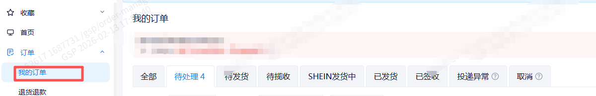
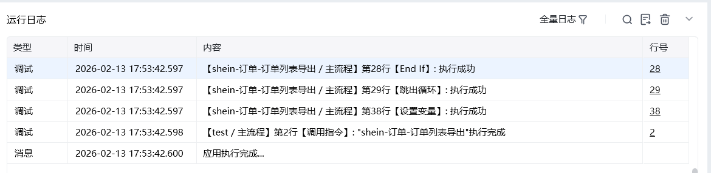

## 一、指令概述

该指令为企业版专享功能，用于自动导出 Shein 店铺的订单列表，支持按商品状态、导出类型筛选，并可自定义文件保存路径与名称，适用于订单统计、对账、数据分析等场景，可替代人工手动下载操作。

## 二、调用参数配置参数名称配置说明约束规则网页对象已登录 Shein 商家后台订单模块的网页对象（用于执行导出操作）必填；需为有效的浏览器网页对象商品状态筛选订单的商品状态，可选：全部、待处理、待发货、待揽收、SHEIN 发货中、已发货、已签收、投递异常、取消必填；决定导出订单的范围导出类型的选择导出的订单数据类型，可选：订单商品信息导出、补贴订单导出、包裹信息导出必填；需与系统支持的导出类型一致自定义文件路径报表保存的本地文件夹路径（可点击 “选择文件夹” 配置）必填；需为本地可访问的文件夹路径自定义文件名称保存文件的名称（不含后缀，如 “2025-01 订单列表”）选填；留空则使用系统默认文件名，填写时无需加后缀开始日期选填，格式：YYYY-MM-DD结束日期选填，格式：YYYY-MM-DD，最多选择90天最晚只能选择当前日期的前一天生成的变量存储文件生成路径的变量名称必填；用于承接输出结果，供下游指令调用
## 三、输出说明

## 四、典型操作示例

<Info>
  使用指令过程中遇到问题？前往 [八爪鱼RPA 开发者社区问答板块](https://rpa.bazhuayu.com/community/questions) 提问，获取官方与社区帮助。
</Info>
