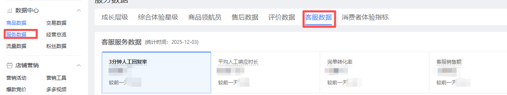

## 一、指令概述

用于从拼多多后台 “数据中心 - 服务数据 - 客服数据” 模块中提取客服服务相关数据，并将数据保存到指定路径。

## 二、调用参数配置参数名称描述配置规则备注网页对象选择已加载的拼多多后台 “数据中心” 页面对象下拉选择已定义的网页对象必填自定义路径数据文件的保存目录输入本地路径（如示例中的 “D:\ 测试文件”），或点击 “选择文件夹” 按钮选取目录必填自定义文件名称数据文件的名称输入自定义文件名（如 “202508 客服服务数据”）选填生成路径数据文件的最终保存路径对应的变量配置变量名，用于记录文件实际保存位置选填
三、使用示例网页对象：选择 “拼多多数据中心页面”；自定义路径：选择 “D:\ 测试文件”；自定义文件名称：输入 “8 月客服服务数据”；执行指令后，系统将自动提取客服服务数据并保存到指定路径，生成路径变量记录文件位置。
## 四、运行效果

指令执行后，会从拼多多后台对应模块中获取客服服务数据，生成文件并保存到自定义路径，可通过 “生成路径” 变量追溯文件存储位置。

<Info>
  使用指令过程中遇到问题？前往 [八爪鱼RPA 开发者社区问答板块](https://rpa.bazhuayu.com/community/questions) 提问，获取官方与社区帮助。
</Info>
