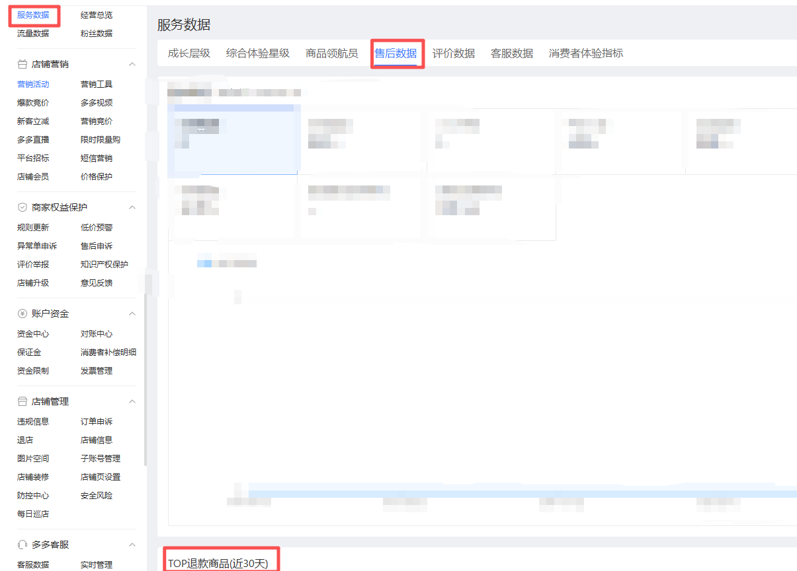

### 指令说明描述：

获取拼多多商家后台-数据中心-服务数据-售后数据-TOP退款商品(近30天)[拼多多商家后台-数据中心-服务数据-售后数据-TOP退款商品(近30天)](https://mms.pinduoduo.com/sycm/goods_quality/detail)中的数据。

<Info>
  使用指令过程中遇到问题？前往 [八爪鱼RPA 开发者社区问答板块](https://rpa.bazhuayu.com/community/questions) 提问，获取官方与社区帮助。
</Info>
