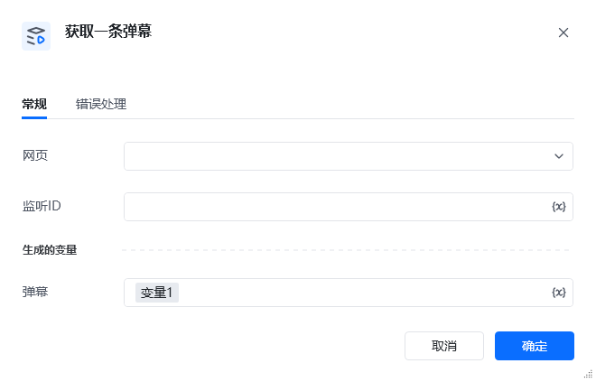

## 1. 指令概述

该 RPA 指令用于从已开启的弹幕监听实例中，获取一条最新的弹幕数据，并将其保存到指定变量中，是弹幕采集流程中承接「开启弹幕监听」的核心指令。
## 2. 配置参数

参数名必填说明<strong>网页</strong>是选择已开启弹幕监听的目标网页对象，需与「开启弹幕监听」指令中选择的网页保持一致。<strong>监听 ID</strong>是填写「开启弹幕监听」时定义的监听实例唯一标识，用于关联对应的监听资源。<strong>弹幕</strong>是定义一个变量名，用于存储获取到的单条弹幕数据。
## 3. 使用示例
### 场景：从已开启的直播弹幕监听中获取一条弹幕并输出

<strong>前置条件</strong>：已通过「开启弹幕监听」指令，在直播页面创建了监听 ID 为 直播弹幕监听ID 的实例。<strong>配置步骤</strong>在「网页」下拉框选择对应的直播页面「监听 ID」输入变量 直播弹幕监听ID「弹幕」输入变量 弹幕<strong>执行效果</strong>

指令会从 直播弹幕监听ID 实例中获取一条最新弹幕文本，保存到 弹幕 变量。

<Info>
  使用指令过程中遇到问题？前往 [八爪鱼RPA 开发者社区问答板块](https://rpa.bazhuayu.com/community/questions) 提问，获取官方与社区帮助。
</Info>
