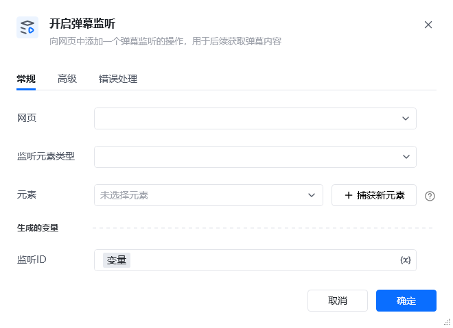
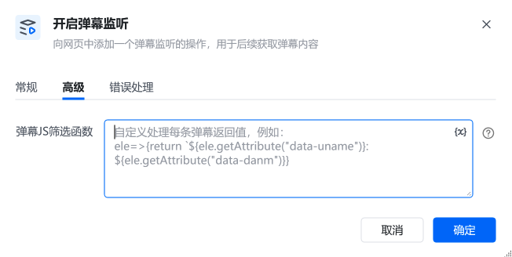

## 1. 指令概述

该 RPA 指令用于向目标网页注入弹幕监听逻辑，可实时捕获网页中的弹幕内容，并通过配置自定义规则提取所需数据，是直播、视频类网页弹幕数据采集的核心前置指令。

## 2. 配置参数

参数名必填说明<strong>网页</strong>是选择需要监听弹幕的目标网页对象，需为当前流程中已打开的网页。<strong>监听元素类型</strong>是选择弹幕对应的 HTML 元素类型（如 div、span），需与目标网页的弹幕 DOM 结构匹配。<strong>元素</strong>是通过「捕获新元素」按钮定位弹幕的父容器或具体节点，用于精准锁定弹幕渲染区域。<strong>监听 ID</strong>是定义一个变量名作为监听实例的唯一标识，后续可通过该 ID 关联获取弹幕数据。<strong>弹幕 JS 筛选函数</strong>	否输入自定义 JavaScript 函数，用于处理每条弹幕元素，提取所需字段（如用户名、弹幕内容）。示例：ele=>\{return ele.getAttribute('data-danm')\}

## 3. 使用示例
场景：采集某直播平台弹幕内容与发送者常规配置 在「网页」下拉框选择当前打开的直播页面。 「监听元素类型」选择 div（假设弹幕以 div 标签渲染）。 点击「捕获新元素」，在网页中框选弹幕显示区域，自动填充「元素」参数。 「监听 ID」填写变量名 <em>直播弹幕监听ID</em>。高级配置 在「弹幕 JS 筛选函数」中输入：ele=>\{ return ele.getAttribute('data-danm') \}，后续通过 「获取一条弹幕」<em> 能获取返回的内容</em>执行效果指令会持续监听目标区域，新弹幕出现时，会通过自定义 JS 函数提取用户名、内容和时间执行成功后，会将监听ID写入到<em>直播弹幕监听ID</em> 变量中，供后续流程（获取一条弹幕、结束弹幕监听）使用。

<Info>
  使用指令过程中遇到问题？前往 [八爪鱼RPA 开发者社区问答板块](https://rpa.bazhuayu.com/community/questions) 提问，获取官方与社区帮助。
</Info>
