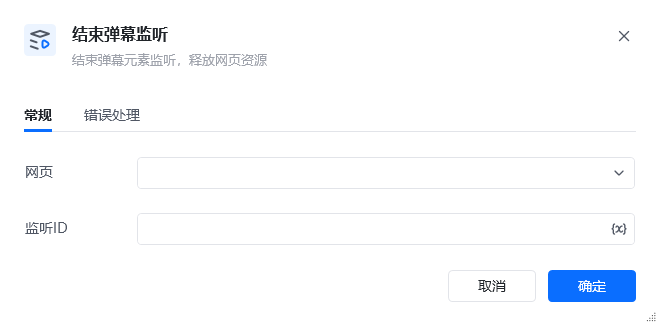

## 1. 功能说明

该 RPA 指令用于终止已开启的弹幕监听实例，释放其占用的网页资源，是弹幕采集流程的收尾指令，可避免长时间监听导致的内存泄漏或性能损耗。
## 2. 配置参数

参数名必填说明<strong>网页</strong>是选择已开启弹幕监听的目标网页对象，需与「开启弹幕监听」指令中选择的网页保持一致。<strong>监听 ID</strong>是填写「开启弹幕监听」时定义的监听实例唯一标识，用于精准终止对应的监听进程。
## 3. 使用示例

场景：完成直播弹幕采集后终止监听<strong>前置条件</strong>：已通过「开启弹幕监听」指令创建了监听 ID 为live_danmu_listener的实例，且已完成弹幕数据采集。<strong>配置步骤</strong>在「网页」下拉框选择对应的直播页面。「监听 ID」输入变量 直播弹幕监听ID<strong>执行效果</strong>

指令会终止 直播弹幕监听ID 对应的监听进程，释放网页中用于监听的 JS 资源与内存，避免后续流程中出现资源占用问题。

<Info>
  使用指令过程中遇到问题？前往 [八爪鱼RPA 开发者社区问答板块](https://rpa.bazhuayu.com/community/questions) 提问，获取官方与社区帮助。
</Info>
