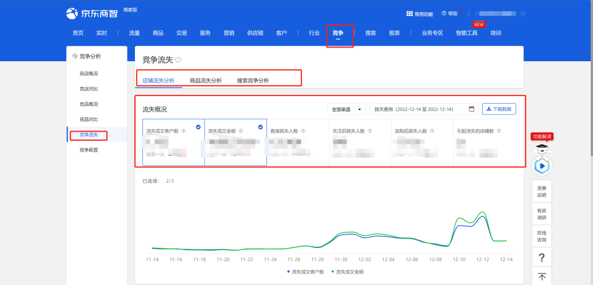
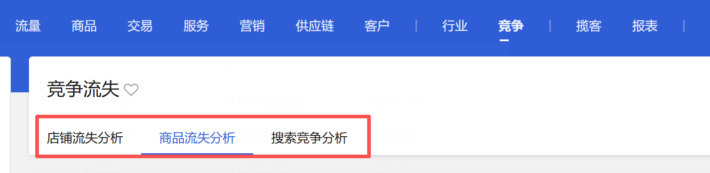
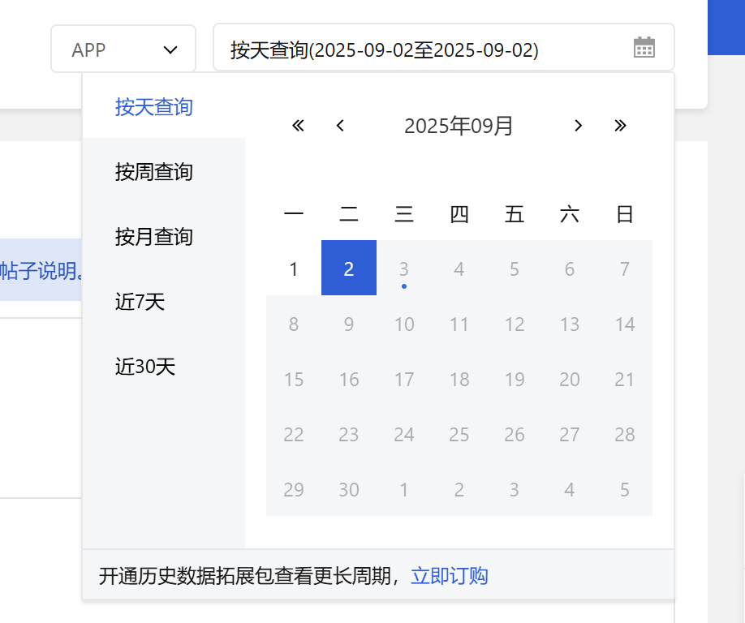

# 描述

该指令实现竞争-竞争流失页面的时间选择功能

# 配置项说明
## 指令输入
#### 网页对象：

任意一个已登录京东商智商家版后台竞争-竞争流失页面的网页对象
#### 数据模块：

下拉框，可选择：店铺流失分析、商品流失分析、搜索竞争分析，必填项

#### 时间查询方式：

下拉框，可选择：按天查询、按周查询、按月查询、近7天、近30天，选填，若不填则使用平台默认值

#### 具体时间：

<Info>
  使用指令过程中遇到问题？前往 [八爪鱼RPA 开发者社区问答板块](https://rpa.bazhuayu.com/community/questions) 提问，获取官方与社区帮助。
</Info>
