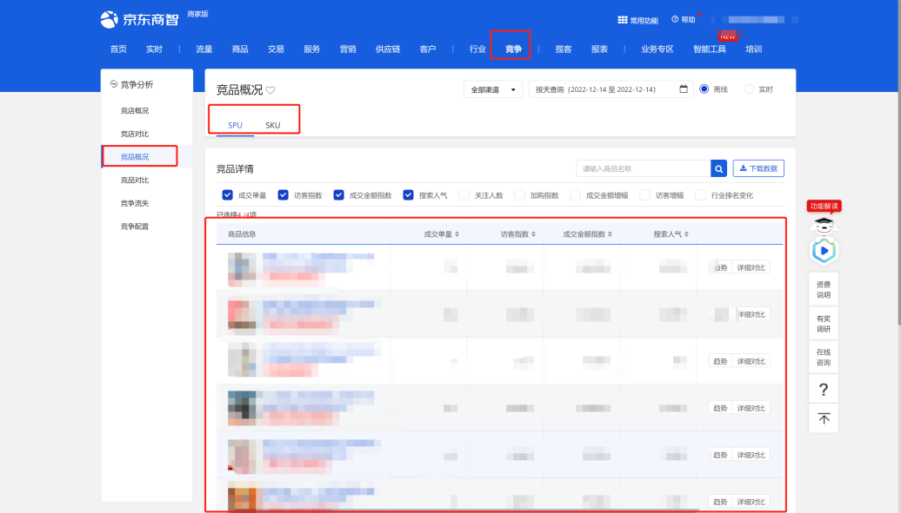
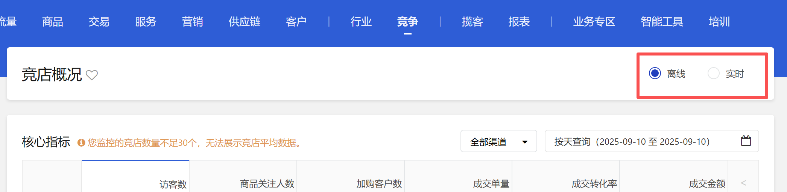
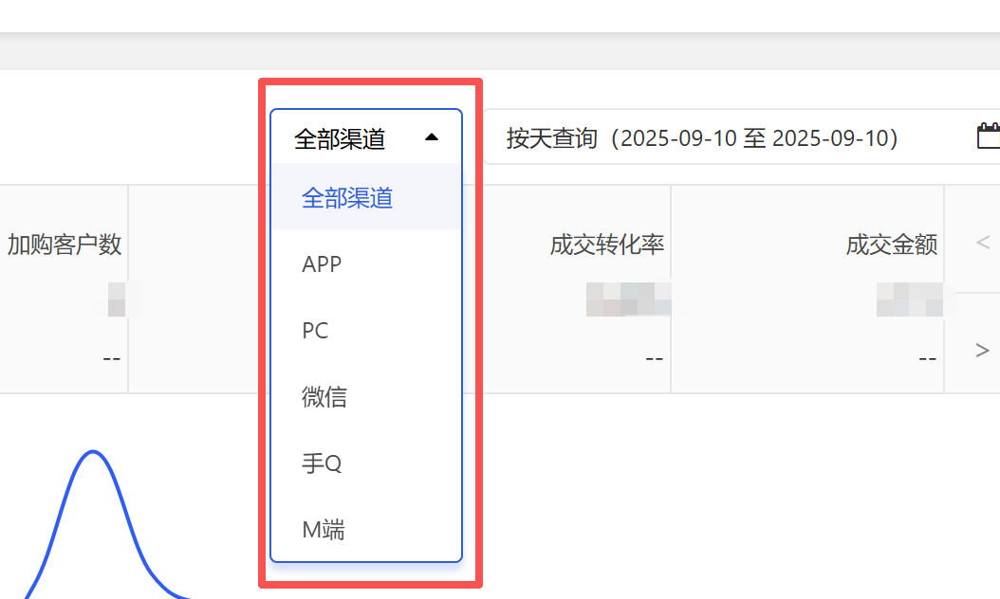
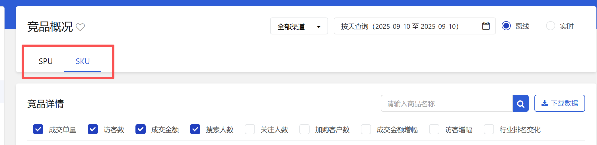
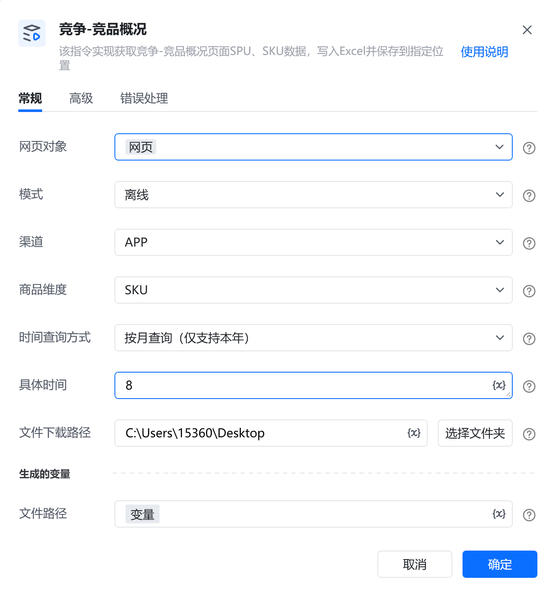
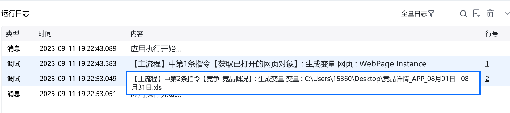
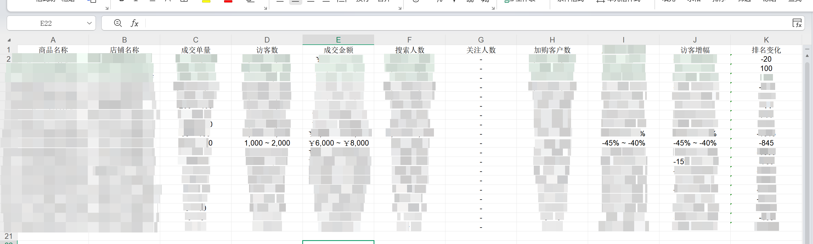

# 描述

该指令实现获取竞争-竞品概况页面SPU、SKU数据，写入Excel并保存到指定位置

# 配置项说明
## 指令输入
#### 网页对象：

任意一个已登录京东商智商家版后台竞争-竞品概况页面的网页对象

#### 模式：

下拉框，可选择：离线、实时，必填项

#### 渠道：

下拉框，可选：全部渠道、APP、PC、微信、手Q、M端，选填，若不填则默认全部渠道

#### #### 商品维度：

下拉框，可选择：SPU、SKU，选填，若不填则默认SPU

#### 时间查询方式：

下拉框，可选择：按天查询、按周查询、按月查询、近7天、近30天，选填，若不填则使用平台默认值

#### 具体日期：

输入具体日期，格式：YYYY-MM-DD，例如：2025-08-01
#### 文件保存路径：

下载的文件保存的文件夹路径，支持本地文件夹预览和变量传参，必填项
#### 自定义文件名：

下载或生成文件保存的名称，选填，若不填则使用平台默认值
## 指令输出
#### 文件路径：

返回文本类型，完整的文件下载路径
# 使用示例

# 运行结果

<Info>
  使用指令过程中遇到问题？前往 [八爪鱼RPA 开发者社区问答板块](https://rpa.bazhuayu.com/community/questions) 提问，获取官方与社区帮助。
</Info>
