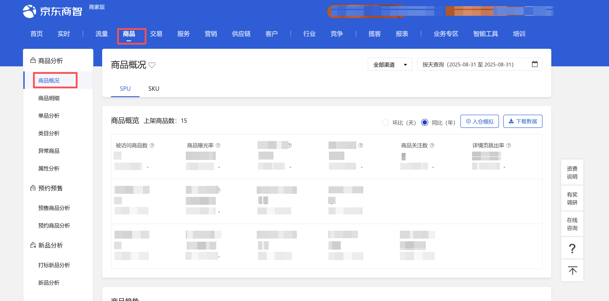
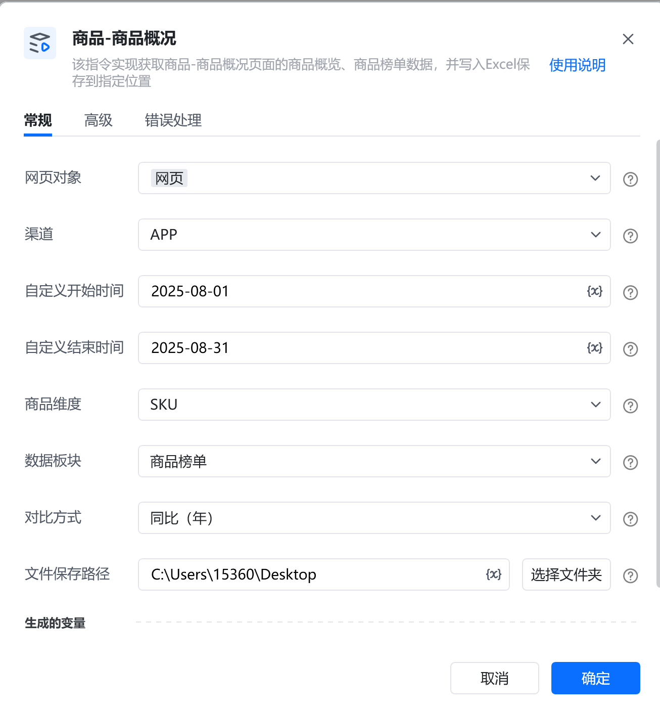
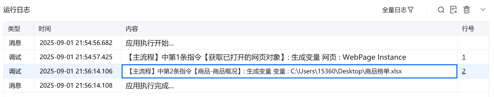
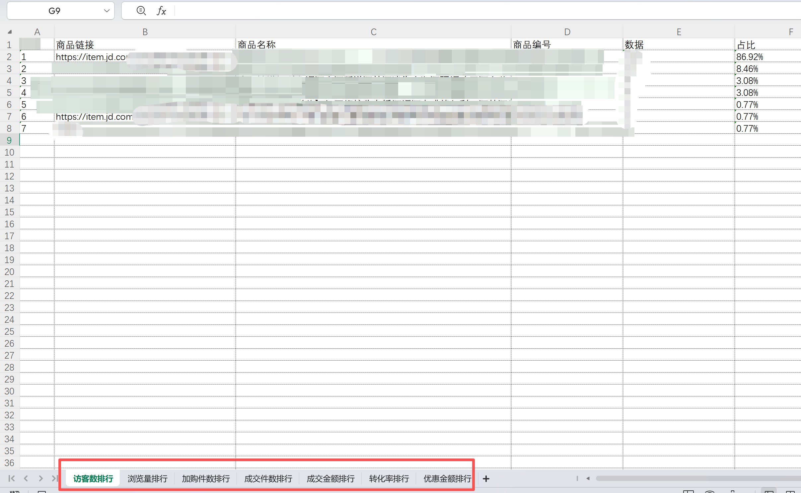
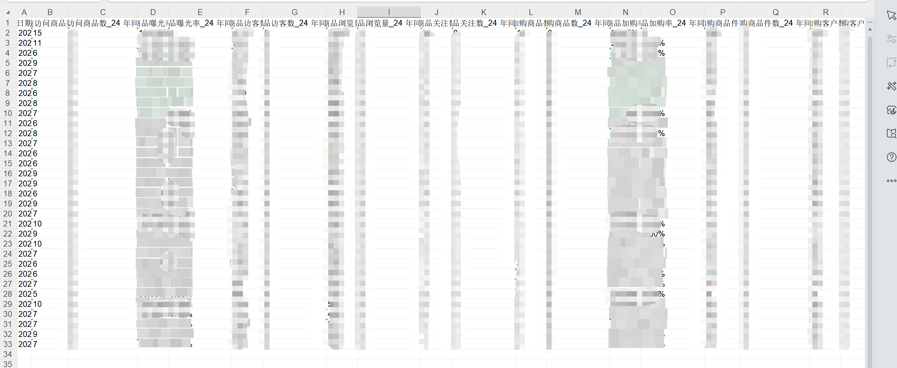

# 描述

该指令实现获取商品-商品概况页面的商品概览、商品榜单数据，并写入Excel保存到指定位置

# 配置项说明
## 指令输入
#### 网页对象：

任意一个已登录京东商智商家版后台商品-商品概况页面的网页对象

#### 渠道：

下拉框，可选：全部渠道、APP、PC、微信、手Q、M端进行数据下载，选填，若不填则默认全部渠道

#### 具体日期：

指定具体日期，例：2025-08-01
#### 自定义开始日期：

指定开始日期进行数据获取或下载，例：2025-08-01。由于平台限制，开始日期与结束日期跨度不可超过31天
#### 自定义结束日期：

指定结束日期进行数据获取或下载，例：2025-08-01。由于平台限制，开始日期与结束日期跨度不可超过31天
#### 商品维度：

下拉框，可选择：SPU、SKU，选填，若不填则使用平台默认值
#### 数据板块：

下拉框，可选择：商品概览、商品榜单，必填项
#### 对比方式：

下拉框，可选择：环比(天)、同比(年)，选填，若不填则使用平台默认值
#### 文件保存路径：

下载或生成文件保存的文件夹路径，支持本地文件夹预览和变量传参，必填
#### 自定义文件名：

下载或生成文件保存的名称，选填，若不填则使用平台默认值
## 指令输出
#### 文件路径：

返回文本类型，完整的文件下载路径
# 使用示例

# 运行结果

<Info>
  使用指令过程中遇到问题？前往 [八爪鱼RPA 开发者社区问答板块](https://rpa.bazhuayu.com/community/questions) 提问，获取官方与社区帮助。
</Info>
