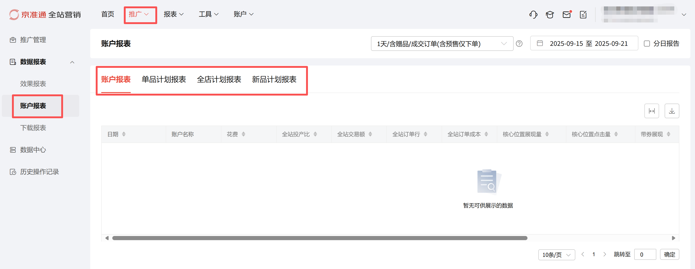
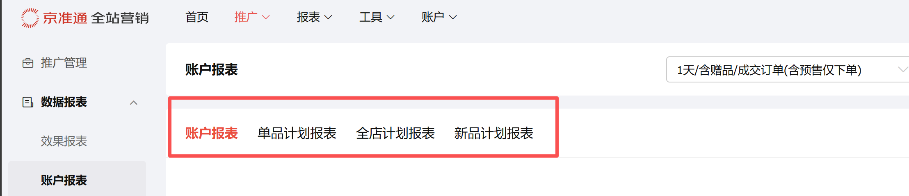
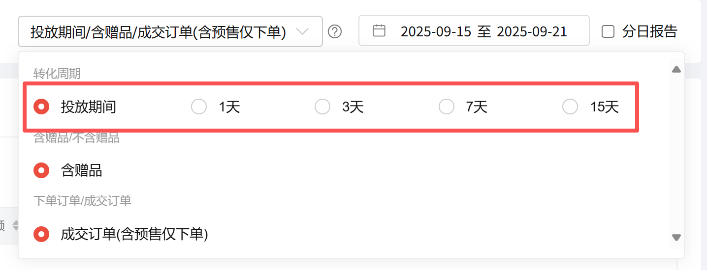
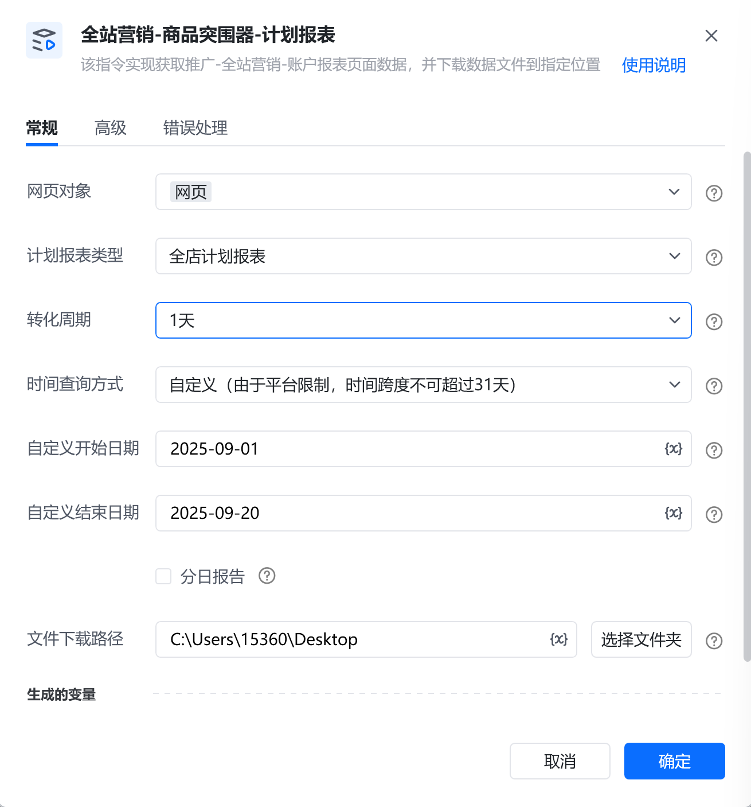
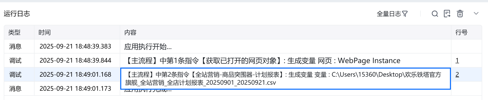
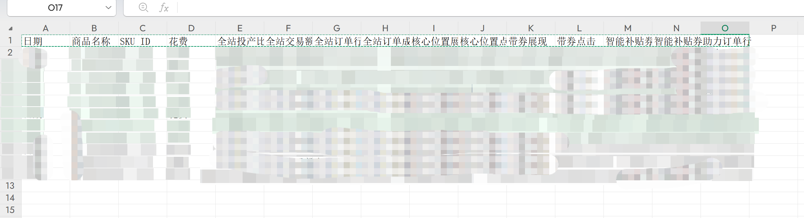

# 描述

该指令实现获取推广-全站营销-账户报表页面数据，并下载数据文件到指定位置

# 配置项说明
## 指令输入
#### 网页对象：

任意一个已登录京准通后台推广-全站营销-账户报表页面的网页对象

#### 计划报表类型：

下拉框，可选择：账户报表、单品计划报表、全店计划报表、新品计划报表，必填项

#### 转化周期：

下拉框，可选：投放期间、1天、3天、7天、15天，选填，若不填则默认投放期间

#### 时间查询方式：

下拉框，可选择：今天、昨天、本周、最近7天、最近15天、本月、最近30天、自定义(注意：由于平台限制，时间跨度不可超过31天)，选填，若不填则使用平台默认值

#### 自定义开始日期：

填写自定义开始日期，格式：YYYY-MM-DD，例如：2025-01-01，仅当时间查询方式为自定义时填写
#### 自定义结束日期：

填写自定义结束日期，格式：YYYY-MM-DD，例如：2025-01-01，仅当时间查询方式为自定义时填写
#### 文件保存路径：

下载的文件保存的文件夹路径，支持本地文件夹预览和变量传参，必填项
#### 自定义文件名：

下载或生成文件保存的名称，选填，若不填则使用平台默认值
## 指令输出
#### 文件路径：

返回文本类型，完整的文件下载路径
# 使用示例

# 运行结果

<Info>
  使用指令过程中遇到问题？前往 [八爪鱼RPA 开发者社区问答板块](https://rpa.bazhuayu.com/community/questions) 提问，获取官方与社区帮助。
</Info>
