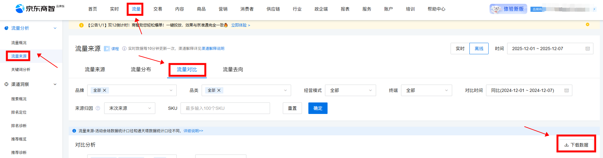
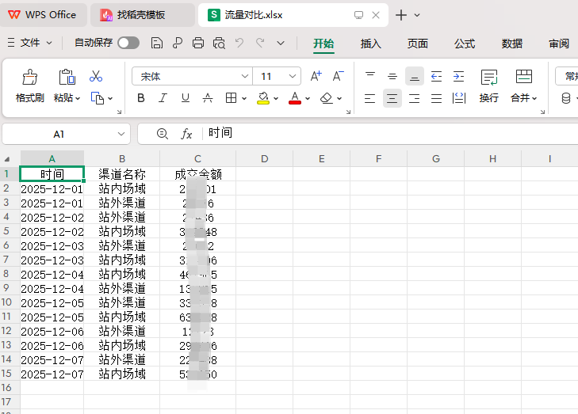

# 京东商智品牌版-流量-流量来源-流量对比下载
# 描述

该指令实现了【京东商智品牌版】->【流量】->【流量来源】->【流量对比】的数据获取，并将数据写入到Excel文件保存到指定路径下；

# 配置说明
适用的浏览器类型Google Chrome浏览器

## 输入

网页对象：已打开的浏览器对象

日期类型：可选择想要取数的维度日期或者快捷日期

自定义 /  昨日 /  近7天  / 近31天  /  按天 /  按周 /  按月

自定义：最多只能选择31天

时间选择：选择需要的时间模式

实时 /  离线

对比类型：可选择需要的对比，可用时间模式为实时 与时间模式为离线 的按天与快捷日期昨日

同比  /  环比  /  农历同比  /  自定义

对比_自定义日期：对比类型为自定义时，可选择需要的对比自定义时间

经营模式：可选择需要的模式

全部   /  自营   /  合作

终端：可选择需要的终端

全部   /  APP   /  微信 /   其他 /   PC /   极速版 /   M端 /   京喜

来源归因：可选择需要的来源

末次来源  /  首次来源

下载渠道：可选择需要的渠道

全部  /  站外渠道  /  站内场域  /  会话结束

指标：可选择需要的指标

浏览量(PV)  /  访客数(UV) /  人均流量量  / 成交金额  /  UV价值  /   客单价  等等

保存文件夹：请输入数据文件保存的文件夹路径

文件名称：自定义自己想要命名的文件名称

## 输出

输出文件路径：输出数据文件的路径

## 数据展示

<Info>
  使用指令过程中遇到问题？前往 [八爪鱼RPA 开发者社区问答板块](https://rpa.bazhuayu.com/community/questions) 提问，获取官方与社区帮助。
</Info>
