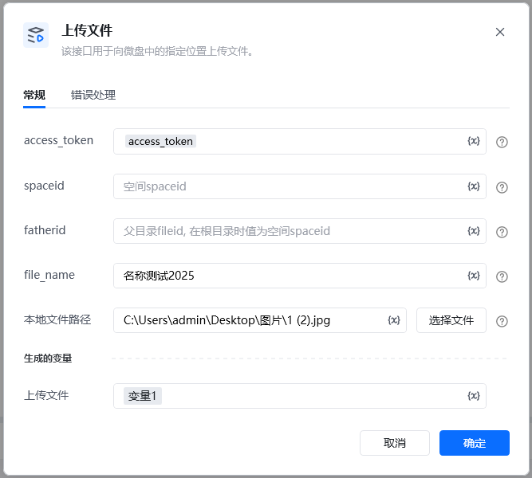

<strong>参数说明：</strong>参数类型是否必须说明ACCESS_TOKENstring是使用指令 【A初始化-获取access_token】获取spaceidstring否空间spaceidfatheridstring否父目录fileid, 在根目录时为空间spaceidfile_namestring是文件名字（注意：文件名最多填255个字符, 英文算1个, 汉字算2个）本地文件路径string是本地文件路径，文件大小上限为10M。

返回字典格式

\{

"fileid": "s.ww8156d878fdf6f8d3.762411572gC0_f.762478780oeXx",

"errcode": 0,

"errmsg": "ok"

\}

<Info>
  使用指令过程中遇到问题？前往 [八爪鱼RPA 开发者社区问答板块](https://rpa.bazhuayu.com/community/questions) 提问，获取官方与社区帮助。
</Info>
