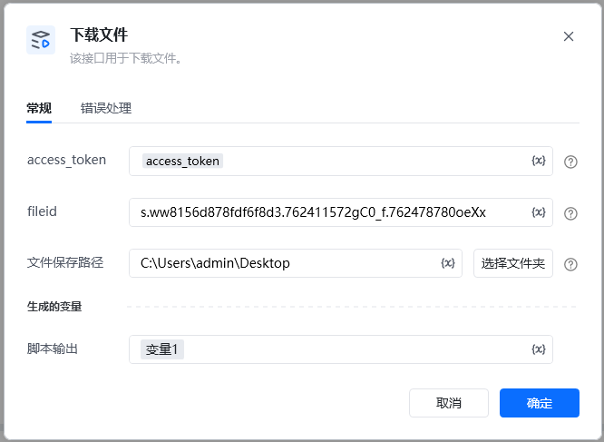

<strong>参数说明</strong>参数类型是否必须说明ACCESS_TOKENstring是接口凭证，使用指令 【A初始化-获取access_token】获取fileidstring否文件fileid（只支持下载普通文件，不支持下载文件夹或微文档）使用指令【获取文件列表】获取文件保存路径string否下载到文件路径，不填写，默认只返回字典类型

字典返回格式

\{

"errcode": 0,

"errmsg": "ok",

"download_url": "DOWNLOAD_URL",

"cookie_name": "COOKIE_NAME",

"cookie_value": "COOKIE_VALUE"

\}

<Info>
  使用指令过程中遇到问题？前往 [八爪鱼RPA 开发者社区问答板块](https://rpa.bazhuayu.com/community/questions) 提问，获取官方与社区帮助。
</Info>
