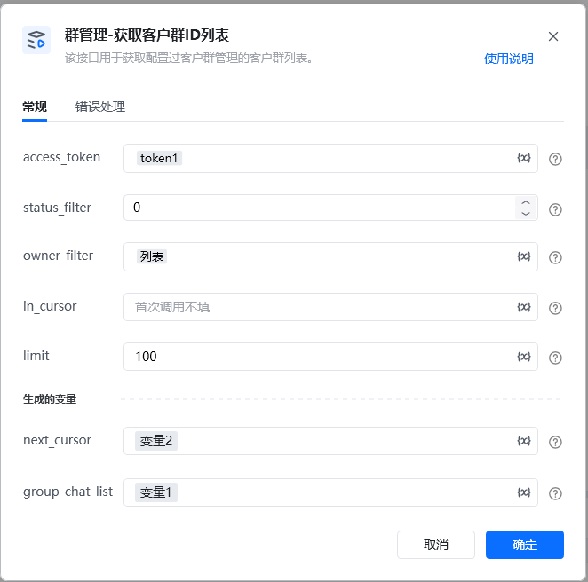
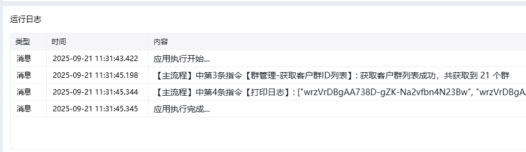

<strong>指令参数说明：</strong>

status_filter

客户群跟进状态过滤。0 - 所有列表(即不过滤)1 - 离职待继承2 - 离职继承中3 - 离职继承完成默认为0

owner_filter

默认不需要填写，群主过滤。如果不填，表示获取应用可见范围内全部群主的数据（但是不建议这么用，如果可见范围人数超过1000人，为了防止数据包过大，会报错 81017）当群主为离职成员时，必须要指定群主过滤才可拉取对应数据

access_token：通过【初始化-获取access_token】指令获取参数

输出为，获取到的群id chat_id 列表

<Info>
  使用指令过程中遇到问题？前往 [八爪鱼RPA 开发者社区问答板块](https://rpa.bazhuayu.com/community/questions) 提问，获取官方与社区帮助。
</Info>
