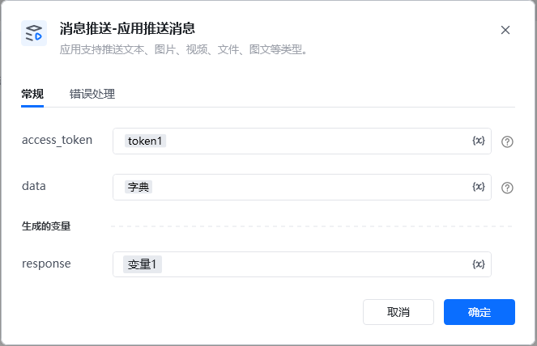
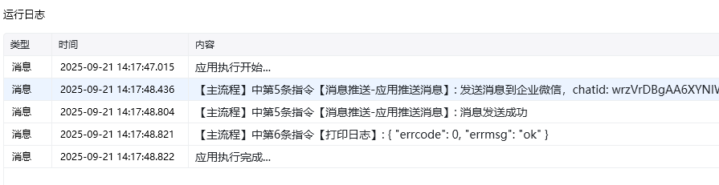

<strong>指令参数说明：</strong>

应用支持推送文本、图片、视频、文件、图文等类型

access_token：通过【初始化-获取access_token】指令获取参数


data可以使用下面的几种示例

chatid，可以通过【群管理-获取客户群ID列表】指令找到对应的群chatid

文本：

```json
{
"chatid": "wrzVrDBgAA6XYNIWw0LMiwva0vFUprhw",
"msgtype": "text",
"text": {
"content": "你的快递已到\n请携带工卡前往邮件中心领取"
},
"safe": 0
}
```

图文，media_id可通过指令【获取临时素材media_id】获取：

```json
{
"chatid": "wrzVrDBgAA6XYNIWw0LMiwva0vFUprhw",
"msgtype":"image",
"image":{
"media_id": "3Gs47RCQ1KOy7dAiBPS9t8tucfi-IT5PCCf9s9HtFfLSzpktPvf39ztN5fmOPqkGwv_UGbYdv9KxON6uuNKuiHg"
},
"safe":0
}
```

图文卡片：

```json
{
"chatid": "wrzVrDBgAA6XYNIWw0LMiwva0vFUprhw",
"msgtype":"textcard",
"textcard":{
"title" : "领奖通知",
"description" : "<div class=\"gray\">2016年9月26日</div> <div class=\"normal\"> 恭喜你抽中iPhone 7一台，领奖码:520258</div><div class=\"highlight\">请于2016年10月10日前联系行 政同事领取</div>",
"url":"https://work.weixin.qq.com/",
"btntxt":"更多"
},
"safe":0
}
```




<Info>
  使用指令过程中遇到问题？前往 [八爪鱼RPA 开发者社区问答板块](https://rpa.bazhuayu.com/community/questions) 提问，获取官方与社区帮助。
</Info>
