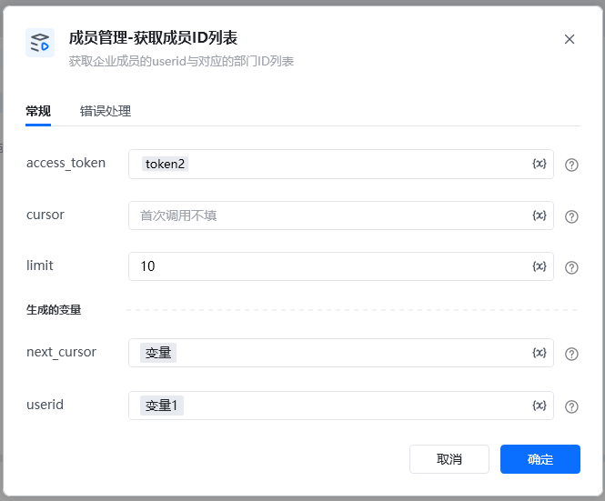
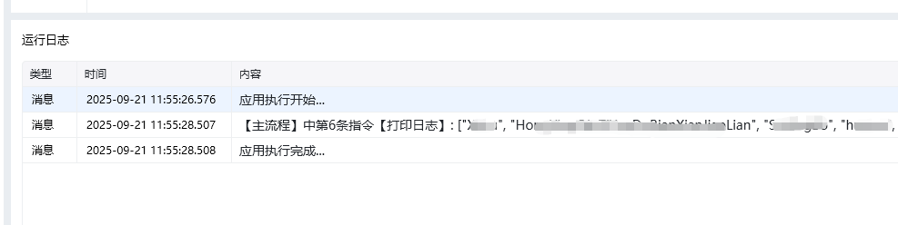

<strong>参数说明：</strong>

access_token：仅支持通过“通讯录同步secret”调用。

通过【初始化-获取access_token】指令获取参数参数必须说明access_token是调用接口凭证cursor否用于分页查询的游标，字符串类型，由上一次调用返回，首次调用不填limit否分页，预期请求的数据量，取值范围 1 ~ 10000

<Info>
  使用指令过程中遇到问题？前往 [八爪鱼RPA 开发者社区问答板块](https://rpa.bazhuayu.com/community/questions) 提问，获取官方与社区帮助。
</Info>
