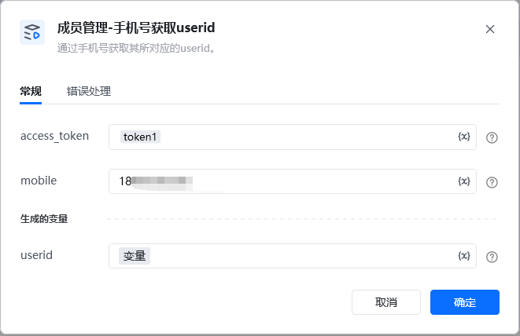
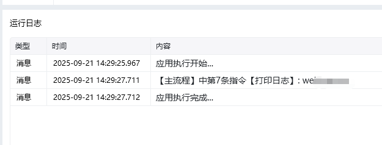

<strong>说明：</strong>请确保手机号的正确性，若出错的次数超出企业人数上限的20%，会导致1天不可调用。

通过【初始化-获取access_token】指令获取参数

<Info>
  使用指令过程中遇到问题？前往 [八爪鱼RPA 开发者社区问答板块](https://rpa.bazhuayu.com/community/questions) 提问，获取官方与社区帮助。
</Info>
