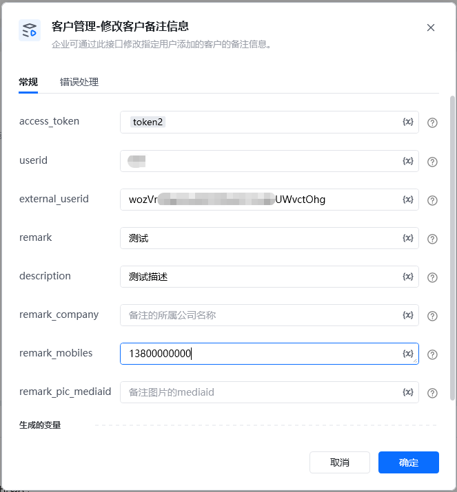
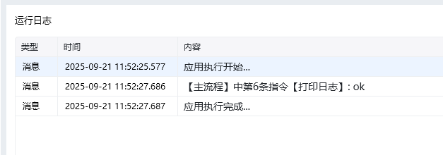

<strong>参数说明</strong>:参数必须说明access_token是调用接口凭证，通过【初始化-获取access_token】指令获取参数userid是企业成员的useridexternal_userid是外部联系人useridremark否此用户对外部联系人的备注，最多20个字符description否此用户对外部联系人的描述，最多150个字符remark_company否此用户对外部联系人备注的所属公司名称，最多20个字符remark_mobiles否此用户对外部联系人备注的手机号remark_pic_mediaid否备注图片的mediaid，调用指令【获取临时素材media_id】

<Info>
  使用指令过程中遇到问题？前往 [八爪鱼RPA 开发者社区问答板块](https://rpa.bazhuayu.com/community/questions) 提问，获取官方与社区帮助。
</Info>
