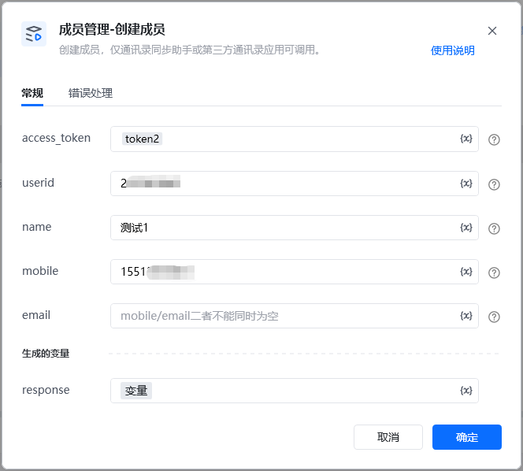
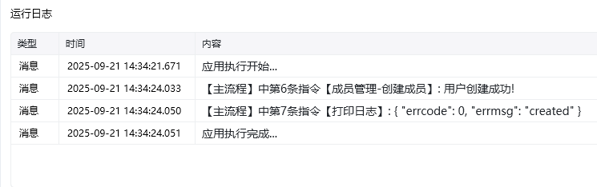

<strong>指令参数说明：</strong>

access_token：仅通讯录同步助手或第三方通讯录应用可调用。通过【初始化-获取access_token】指令获取参数

<Info>
  使用指令过程中遇到问题？前往 [八爪鱼RPA 开发者社区问答板块](https://rpa.bazhuayu.com/community/questions) 提问，获取官方与社区帮助。
</Info>
