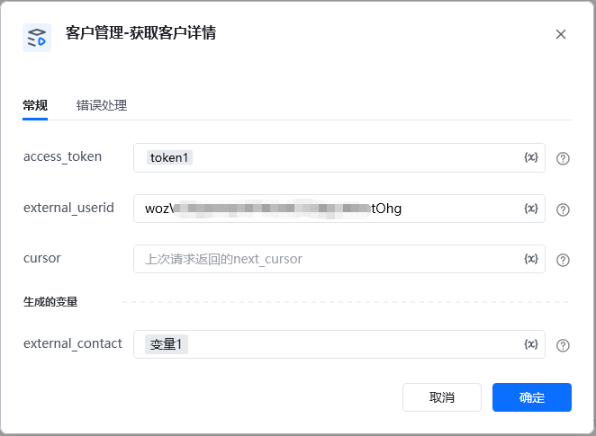
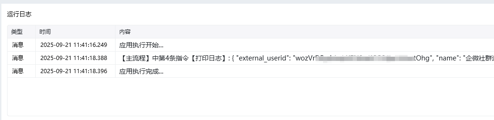

<strong>指令参数说明：</strong>

external_userid： 外部联系人的userid，注意不是企业成员的账号，通过指令【获取客户列表】获取

access_token：通过【初始化-获取access_token】指令获取参数

<Info>
  使用指令过程中遇到问题？前往 [八爪鱼RPA 开发者社区问答板块](https://rpa.bazhuayu.com/community/questions) 提问，获取官方与社区帮助。
</Info>
