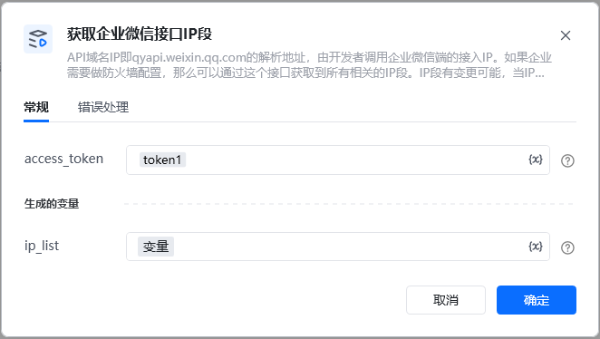
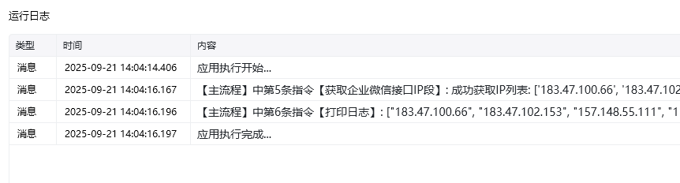

接口获取到所有相关的IP段。IP段有变更可能，当IP段变更时，新旧IP段会同时保留一段时间。

建议企业每天定时拉取IP段，更新防火墙设置，避免因IP段变更导致网络不通。

通过【初始化-获取access_token】指令获取参数

<Info>
  使用指令过程中遇到问题？前往 [八爪鱼RPA 开发者社区问答板块](https://rpa.bazhuayu.com/community/questions) 提问，获取官方与社区帮助。
</Info>
