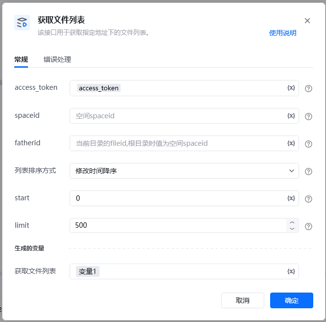
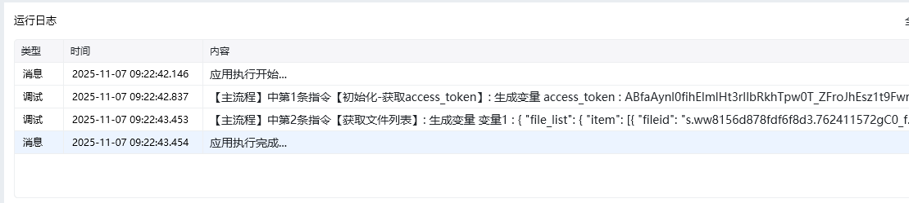

<strong>参数说明</strong>参数类型是否必须说明ACCESS_TOKENstring是调用接口凭证，使用指令 【A初始化-获取access_token】获取spaceidstring是空间spaceidfatheridstring是当前目录的fileid,根目录时为空间spaceid列表排序方式uint32是列表排序方式 1:名字升序；2:名字降序；3:大小升序；4:大小降序；5:修改时间升序；6:修改时间降序startuint32是首次填0, 后续填上一次请求返回的next_startlimituint32是分批拉取最大文件数, 不超过1000

<Info>
  使用指令过程中遇到问题？前往 [八爪鱼RPA 开发者社区问答板块](https://rpa.bazhuayu.com/community/questions) 提问，获取官方与社区帮助。
</Info>
