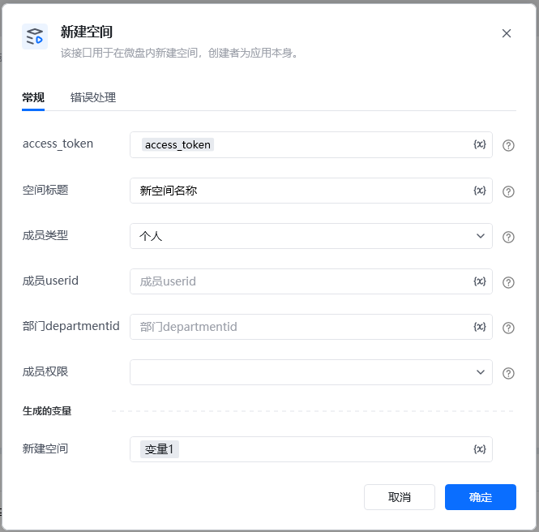
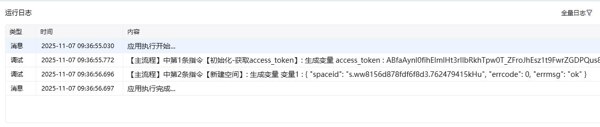
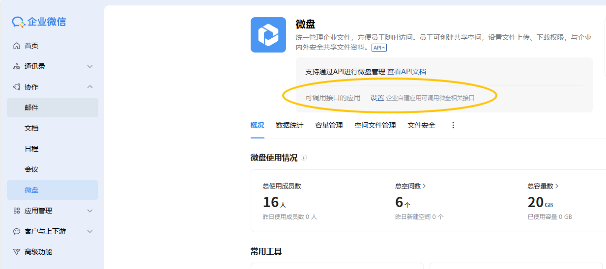

<strong>参数说明</strong>ACCESS_TOKENstring是接口凭证，通知指令【A初始化-获取access_token】获取空间标题string是空间标题成员类型uint32否成员类型 1:个人 2:部门成员useridstring否成员userid,字符串，可使用指令【成员管理-手机号获取userid】获取部门departmentiduint32否部门departmentid,成员权限uint32否成员权限 1:仅下载 4:可预览（仅专业版微盘企业可设置） 7:应用空间管理员(最多可指定3个，不支持设置部门)

<strong>权限说明</strong>自建应用需配置到“可调用应用”列表中的应用secret所获取的accesstoken来调用第三方应用需具有“微盘”权限代开发自建应用需具有“微盘”权限

登录企业微信后台，设置可调用接口的应用

<Info>
  使用指令过程中遇到问题？前往 [八爪鱼RPA 开发者社区问答板块](https://rpa.bazhuayu.com/community/questions) 提问，获取官方与社区帮助。
</Info>
