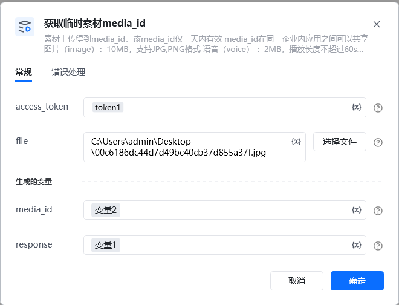
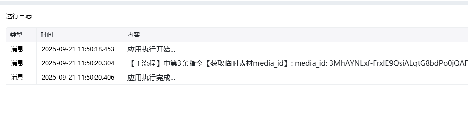

<strong>参数说明：</strong>参数必须说明access_token是调用接口凭证file是媒体文件类型，分别有图片（image）、语音（voice）、视频（video），普通文件（file）

<strong>access_token:</strong>通过【初始化-获取access_token】指令获取参数

<strong>返回参数说明：</strong>参数说明type媒体文件类型，分别有图片（image）、语音（voice）、视频（video），普通文件(file)media_id媒体文件上传后获取的唯一标识，3天内有效created_at媒体文件上传时间戳
## <strong>上传的媒体文件限制</strong>

所有文件size必须大于5个字节图片（image）：10MB，支持JPG,PNG格式语音（voice） ：2MB，播放长度不超过60s，<strong>仅支持</strong>AMR格式视频（video） ：10MB，支持MP4格式普通文件（file）：20MB

<Info>
  使用指令过程中遇到问题？前往 [八爪鱼RPA 开发者社区问答板块](https://rpa.bazhuayu.com/community/questions) 提问，获取官方与社区帮助。
</Info>
