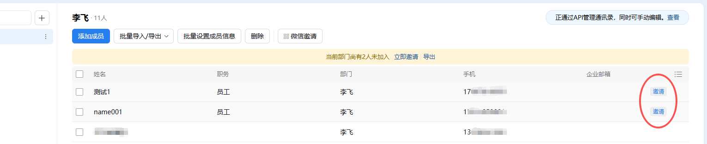
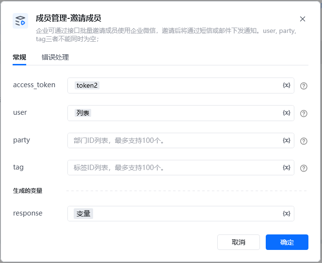

企业可通过接口批量邀请成员使用企业微信，邀请后将通过短信或邮件下发通知。哪些用户需要邀请，后台通讯录 成员账号，可以看到有邀请按钮

通讯录里面找到 成员账号，就是对应的userid

<strong>指令参数说明：</strong><strong>access_token：通过【初始化-获取access_token】指令获取参数</strong>

<strong>user：</strong>成员ID列表，填写需要邀请的用户userid列表

<strong>party：</strong>部门ID列表，可以同步指令【部门管理-获取部门列表】获取参数

<strong>tag：</strong>标签ID列表

<strong>更多说明：</strong>user, party, tag三者不能同时为空；如果部分接收人无权限或不存在，邀请仍然执行，但会返回无效的部分（即invaliduser或invalidparty或invalidtag）;同一用户只须邀请一次，被邀请的用户如果未安装企业微信，在3天内每天会收到一次通知，最多持续3天。因为邀请频率是异步检查的，所以调用接口返回成功，并不代表接收者一定能收到邀请消息（可能受上述频率限制无法接收）。境外成员可用企业录入的邮箱登录企业微信。

<Info>
  使用指令过程中遇到问题？前往 [八爪鱼RPA 开发者社区问答板块](https://rpa.bazhuayu.com/community/questions) 提问，获取官方与社区帮助。
</Info>
