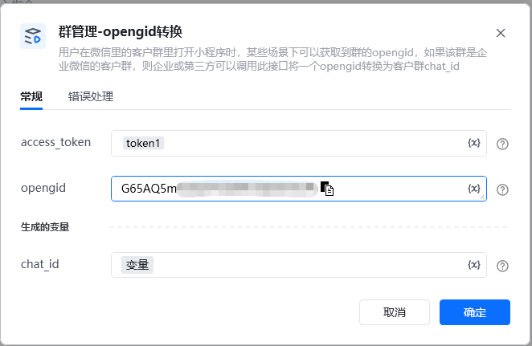
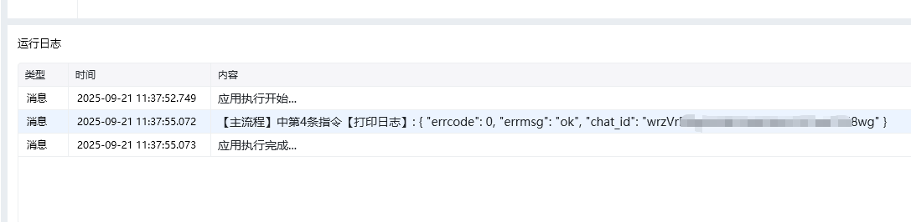

<strong>指令参数说明：</strong>

opengid

小程序在微信获取到的群ID，参见wx.getGroupEnterInfo[wx.getGroupEnterInfo](https://developers.weixin.qq.com/miniprogram/dev/api/open-api/group/wx.getGroupEnterInfo.html)

access_token：通过【初始化-获取access_token】指令获取参数

<Info>
  使用指令过程中遇到问题？前往 [八爪鱼RPA 开发者社区问答板块](https://rpa.bazhuayu.com/community/questions) 提问，获取官方与社区帮助。
</Info>
