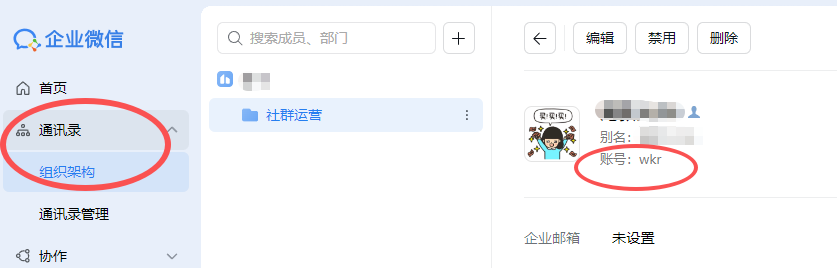
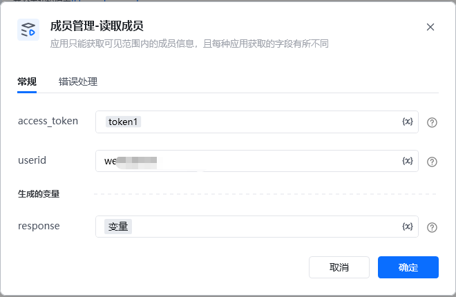
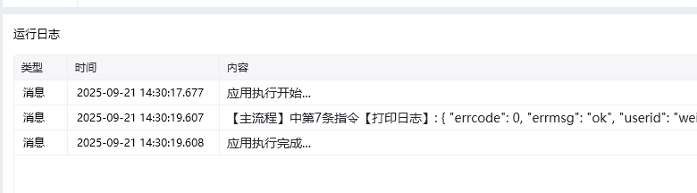

<strong>指令参数说明：</strong>

<strong>access_token：</strong>通过【初始化-获取access_token】指令获取参数

<strong>userid ：</strong>企业成员的userid

可通过企业微信管理后台，通讯录里面找到 成员账号，就是对应的userid

<Info>
  使用指令过程中遇到问题？前往 [八爪鱼RPA 开发者社区问答板块](https://rpa.bazhuayu.com/community/questions) 提问，获取官方与社区帮助。
</Info>
