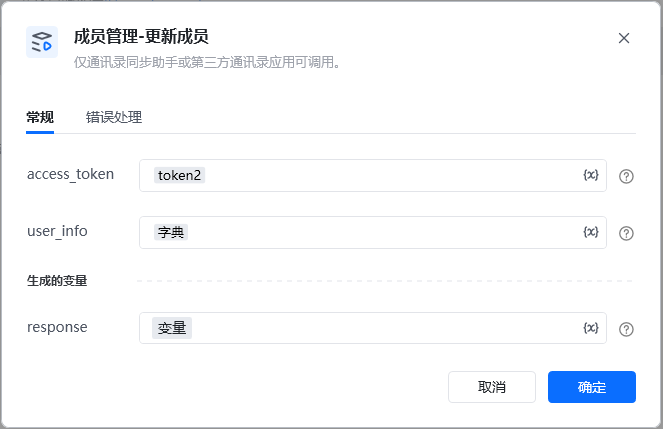
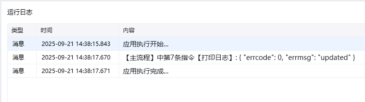

<strong>权限说明：</strong>

<strong>指令参数说明：</strong>

仅通讯录同步助手或第三方通讯录应用可调用。

<strong>access_token：</strong>通过【初始化-获取access_token】指令获取参数

<strong>user_info</strong> ：数据类型：字典，简单示例，

\{

"userid": "123",

"name": "测试名称1",

"position": "后台工程师",

"mobile": "13800000003"

\}

user_info需要更多更新参考下面\{
"userid": "zhangsan",
"name": "李四",
"department": [1],
"order": [10],
"position": "后台工程师",
"mobile": "13800000000",
"gender": "1",
"email": "zhangsan@qq.com",
"biz_mail":"zhangsan@tencent.com",
"biz_mail_alias":\{
"item":["jack@tencent.com", "hr@tencent.com"]
\},
"is_leader_in_dept": [1],
"direct_leader":["lisi"],
"enable": 1,
"avatar_mediaid": "2-G6nrLmr5EC3MNb_-zL1dDdzkd0p7cNliYu9V5w7o8K0",
"telephone": "020-123456",
"alias": "jackzhang",
"address": "广州市海珠区新港中路",
"main_department": 1,
"extattr": \{
"attrs": [
\{
"type": 0,
"name": "文本名称",
"text": \{
"value": "文本"
\}
\},
\{
"type": 1,
"name": "网页名称",
"web": \{
"url": "http://www.test.com",
"title": "标题"
\}
\}
]
\},
"external_position": "工程师",
"external_profile": \{
"external_corp_name": "企业简称",
"wechat_channels": \{
"nickname": "视频号名称"
\},
"external_attr": [
\{
"type": 0,
"name": "文本名称",
"text": \{
"value": "文本"
\}
\},
\{
"type": 1,
"name": "网页名称",
"web": \{
"url": "http://www.test.com",
"title": "标题"
\}
\},
\{
"type": 2,
"name": "测试app",
"miniprogram": \{
"appid": "wx8bd80126147dFAKE",
"pagepath": "/index",
"title": "my miniprogram"
\}
\}
]
\}
\}

<strong>参数说明：</strong>

参数必须说明access_token是调用接口凭证userid是成员UserID。对应管理端的账号，企业内必须唯一。不区分大小写，长度为1~64个字节name否成员名称。长度为1~64个utf8字符alias否别名。长度为1-64个utf8字符mobile否手机号码。企业内必须唯一。若成员已激活企业微信，则需成员自行修改（此情况下该参数被忽略，但不会报错） ，中国大陆手机号码可省略“+86”，其他国家或地区必须要带上国际码。department否成员所属部门id列表，不超过100个order否部门内的排序值，默认为0。当有传入department时有效。数量必须和department一致，数值越大排序越前面。有效的值范围是[0, 2^32)position否职务信息。长度为0~128个utf8字符gender否性别。1表示男性，2表示女性email否邮箱。可填写企业已有的邮箱账号，方便同事获取成员的邮箱账号以发邮件。长度6~64个字节，且为有效的email格式。企业内必须唯一。境外成员可用此邮箱登录企业微信。biz_mail否如果企业已开通腾讯企业邮（企业微信邮箱），设置该值可创建企业邮箱账号。长度6~63个字节，且为有效的企业邮箱格式。企业内必须唯一。未填写则系统会为用户生成默认企业邮箱（由系统生成的邮箱可修改一次）。biz_mail_alias否企业邮箱别名。长度6~63个字节，且为有效的企业邮箱格式。企业内必须唯一，最多可设置5个别名。更新时为覆盖式更新。传空结构或传空数组会清空当前企业邮箱别名。telephone否座机。由1-32位的纯数字、“-”、“+”或“,”组成is_leader_in_dept否部门负责人字段，个数必须和department一致，表示在所在的部门内是否为负责人。0-否，1-是direct_leader否直属上级，可以设置企业范围内成员为直属上级，最多设置1个avatar_mediaid否成员头像的mediaid，可通过指令【获取临时素材media_id】获取enable否启用/禁用成员。1表示启用成员，0表示禁用成员extattr否扩展属性。扩展属性字段需要先在WEB管理端添加，见扩展属性添加方法[扩展属性添加方法](https://developer.work.weixin.qq.com/document/path/90197#10016/%E6%89%A9%E5%B1%95%E5%B1%9E%E6%80%A7%E7%9A%84%E6%B7%BB%E5%8A%A0%E6%96%B9%E6%B3%95)，否则忽略未知属性的赋值。字段详情见成员扩展属性[成员扩展属性](https://developer.work.weixin.qq.com/document/path/90197#54430)external_profile否成员对外属性，字段详情见对外属性[对外属性](https://developer.work.weixin.qq.com/document/path/90197#13450)external_position否对外职务，如果设置了该值，则以此作为对外展示的职务，否则以position来展示。不超过12个汉字nickname否视频号名字（设置后，成员将对外展示该视频号）。须从企业绑定到企业微信的视频号中选择，可在“我的企业”页中查看绑定的视频号address否地址。长度最大128个字符main_department否主部门

<Info>
  使用指令过程中遇到问题？前往 [八爪鱼RPA 开发者社区问答板块](https://rpa.bazhuayu.com/community/questions) 提问，获取官方与社区帮助。
</Info>
