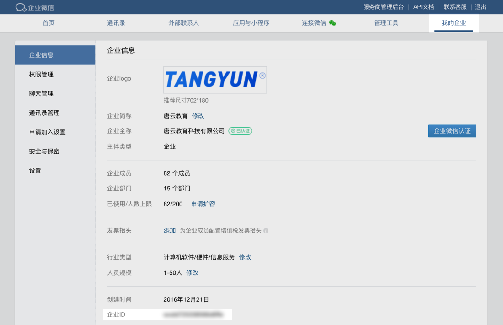
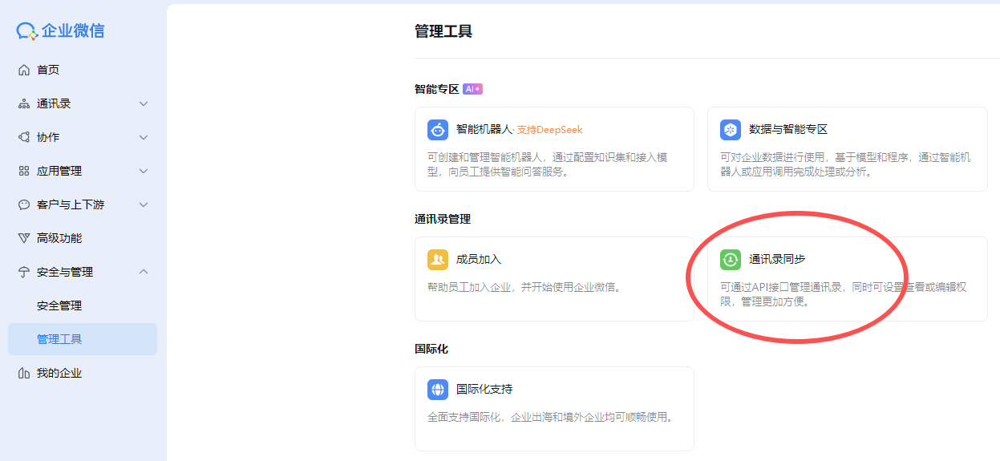
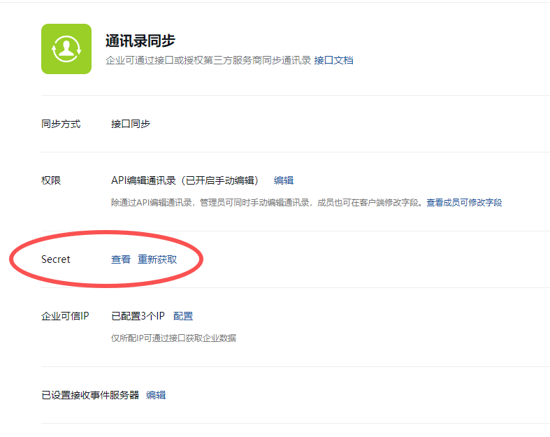

<strong>参数说明：</strong>参数必须说明corpid是企业ID，获取方式参考：术语说明-corpid[术语说明-corpid](https://developer.work.weixin.qq.com/document/path/91039#14953/corpid)corpsecret是应用的凭证密钥，<strong>注意应用需要是启用状态</strong>，获取方式参考：术语说明-secret[术语说明-secret](https://developer.work.weixin.qq.com/document/path/91039#14953/secret)

<strong>权限说明：</strong>每个应用有独立的secret，获取到的access_token只能本应用使用，所以每个应用的access_token应该分开来获取
### corpid

每个企业都拥有唯一的corpid，获取此信息可在管理后台“我的企业”－“企业信息”下查看“企业ID”（需要有管理员权限）

### secret

secret是企业应用里面用于保障数据安全的“钥匙”，<strong>每一个应用都有一个独立的访问密钥</strong>，为了保证数据的安全，secret务必不能泄漏。

secret查看方法：1.在管理后台->“应用管理”->“应用”->“自建”，点进某个应用，即可看到。

2.【获取成员ID列表】，【创建成员】，【邀请成员】【更新成员】【邮箱获取userid】这些权限需要调用通讯录同步的Secret

<strong>返回结果：</strong>\{
"errcode": 0,
"errmsg": "ok",
"access_token": "accesstoken000001",
"expires_in": 7200
\}

<strong>参数说明：</strong>

参数说明errcode出错返回码，为0表示成功，非0表示调用失败errmsg返回码提示语access_token获取到的凭证，最长为512字节expires_in凭证的有效时间（秒）

<Info>
  使用指令过程中遇到问题？前往 [八爪鱼RPA 开发者社区问答板块](https://rpa.bazhuayu.com/community/questions) 提问，获取官方与社区帮助。
</Info>
