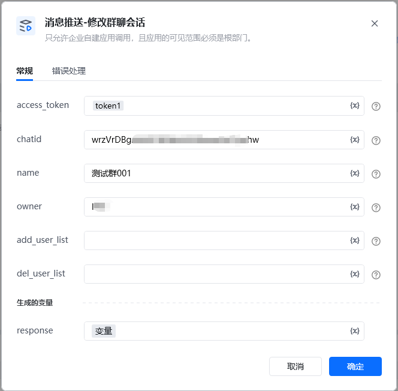
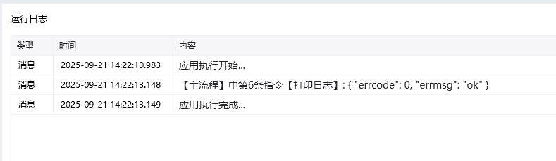

<strong>参数说明：</strong>

参数是否必须说明access_token是调用接口凭证通过【初始化-获取access_token】指令获取参数chatid是群聊idname否新的群聊名。若不需更新，请忽略此参数。最多50个utf8字符，超过将截断owner否新群主的id。若不需更新，请忽略此参数。课程群聊群主必须拥有课程群创建权限，del_user_list包含群主时本字段必填add_user_list否添加成员的id列表del_user_list否踢出成员的id列表

<Info>
  使用指令过程中遇到问题？前往 [八爪鱼RPA 开发者社区问答板块](https://rpa.bazhuayu.com/community/questions) 提问，获取官方与社区帮助。
</Info>
