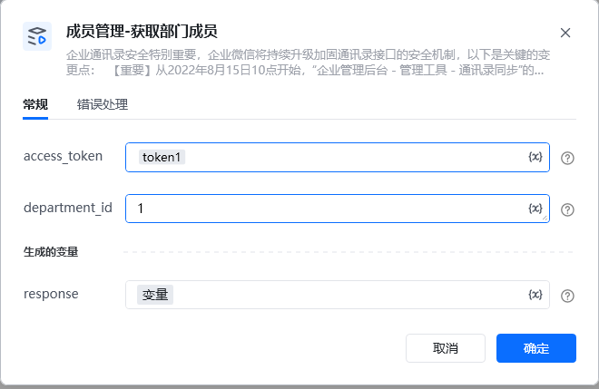
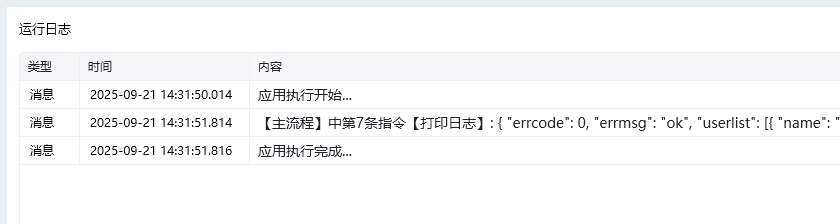

<strong>参数说明：</strong>参数必须说明access_token是调用接口凭证department_id是获取的部门id如需获取该部门及其子部门的所有成员，需先获取该部门下的子部门，然后再获取子部门下的部门成员，逐层递归获取。

access_token：通过【初始化-获取access_token】指令获取参数

department_id：可通过指令【部门管理-获取部门列表】或者【获取子部门ID列表】获取部门id

<Info>
  使用指令过程中遇到问题？前往 [八爪鱼RPA 开发者社区问答板块](https://rpa.bazhuayu.com/community/questions) 提问，获取官方与社区帮助。
</Info>
