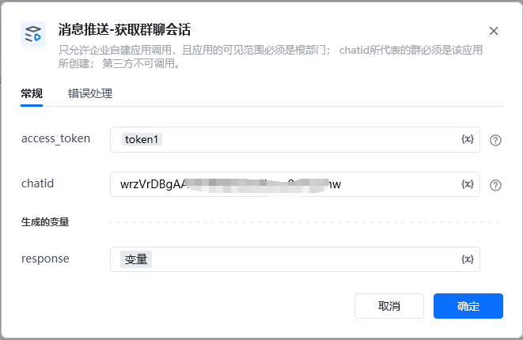
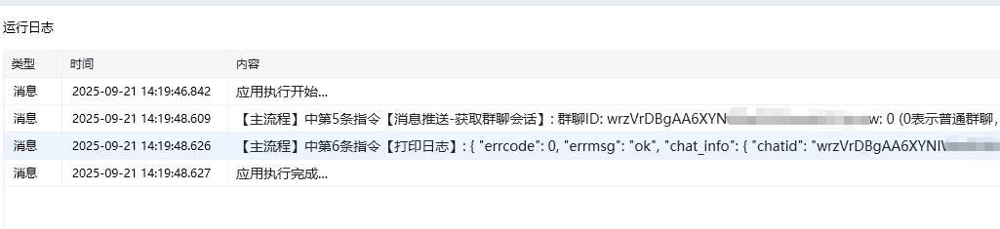

<strong>参数说明：</strong>参数是否必须说明access_token是调用接口凭证chatid是群聊id

<strong>access_token</strong>，<strong>通过【初始化-获取access_token】指令获取参数</strong>

<strong>chatid，</strong>群聊id，通过指令【获取客户群ID列表】获取群chatid

<strong>权限说明：</strong>只允许企业自建应用调用，且应用的可见范围必须是根部门；chatid所代表的群必须是该应用所创建；第三方不可调用。

<Info>
  使用指令过程中遇到问题？前往 [八爪鱼RPA 开发者社区问答板块](https://rpa.bazhuayu.com/community/questions) 提问，获取官方与社区帮助。
</Info>
