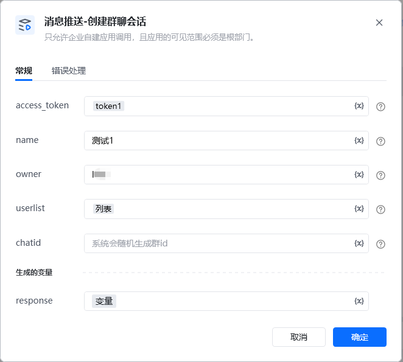
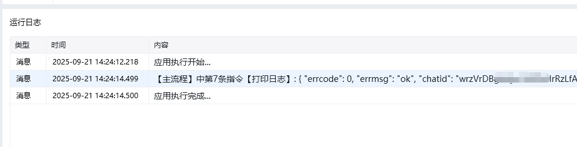

<strong>参数说明：</strong>参数是否必须说明access_token是调用接口凭证，通过【初始化-获取access_token】指令获取参数name否群聊名，最多50个utf8字符，超过将截断owner否指定群主的id。如果不指定，系统会随机从userlist中选一人作为群主userlist是群成员id列表。至少2人，至多2000人chatid否群聊的唯一标志，不能与已有的群重复；字符串类型，最长32个字符。只允许字符0-9及字母a-zA-Z。如果不填，系统会随机生成群id

<Info>
  使用指令过程中遇到问题？前往 [八爪鱼RPA 开发者社区问答板块](https://rpa.bazhuayu.com/community/questions) 提问，获取官方与社区帮助。
</Info>
