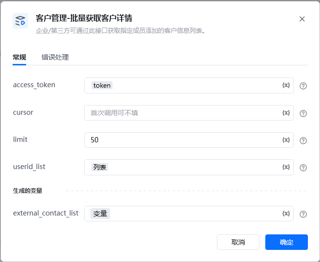
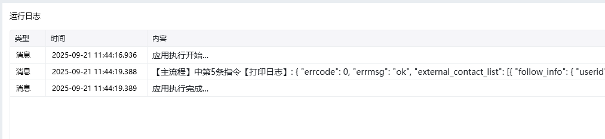

企业/第三方可通过此接口获取指定成员添加的客户信息列表。

<strong>指令参数说明：</strong>

access_token：通过【初始化-获取access_token】指令获取参数

cursor， 非必填 用于分页查询的游标，字符串类型，由上一次调用返回结果，首次调用可不填

limit	，非必填	整型，最大值100，默认值50，超过最大值时取最大值

userid_list 必填 企业成员的userid列表，通过指令【获取客户列表】获取，最多支持100个

<Info>
  使用指令过程中遇到问题？前往 [八爪鱼RPA 开发者社区问答板块](https://rpa.bazhuayu.com/community/questions) 提问，获取官方与社区帮助。
</Info>
