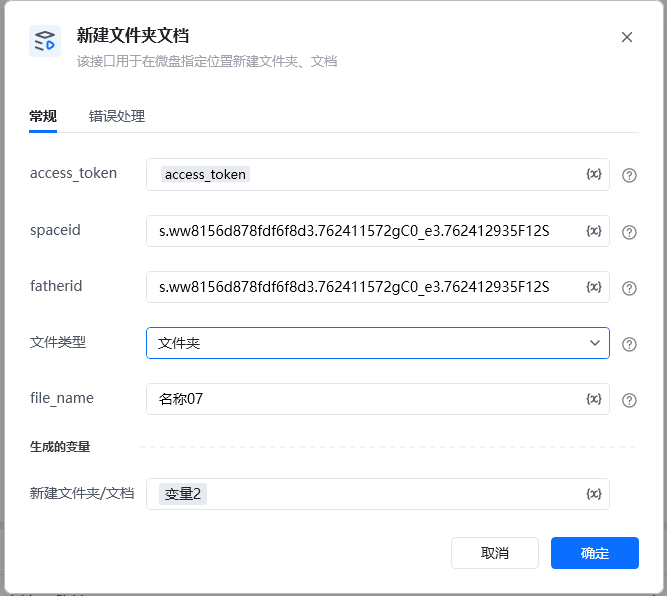
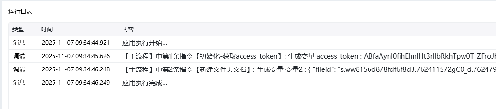

<strong>参数说明</strong>参数类型是否必须说明ACCESS_TOKENstring是调用凭证，使用指令 【A初始化-获取access_token】获取spaceidstring是空间spaceidfatheridstring是父目录fileid, 在根目录时为空间spaceid文件类型uint32是文件类型, 1:文件夹 3:文档(文档) 4:文档(表格)file_namestring是文件名字（注意：文件名最多填255个字符, 英文算1个, 汉字算2个）

<Info>
  使用指令过程中遇到问题？前往 [八爪鱼RPA 开发者社区问答板块](https://rpa.bazhuayu.com/community/questions) 提问，获取官方与社区帮助。
</Info>
