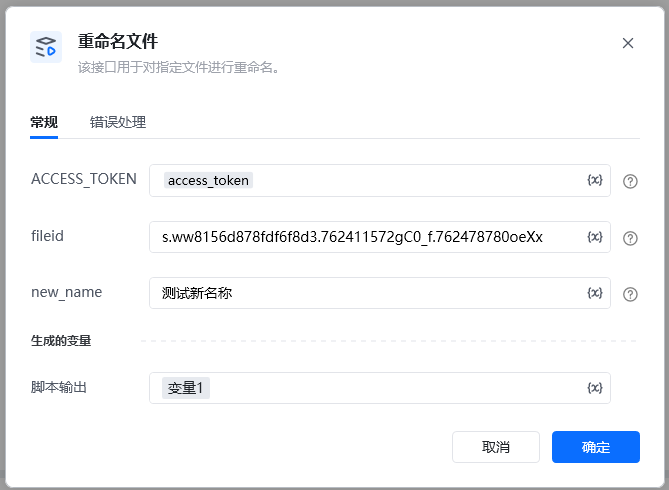
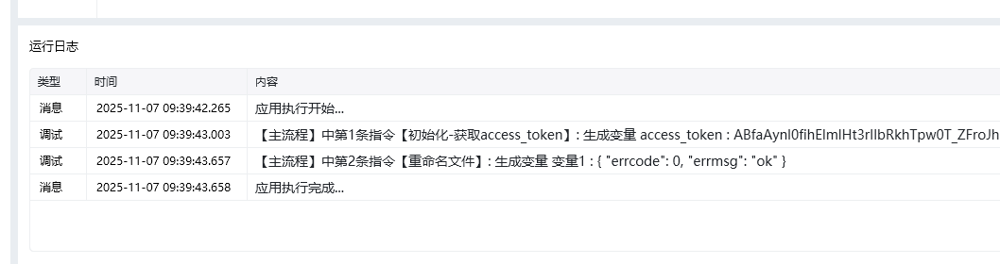

<strong>参数说明</strong>参数类型是否必须说明ACCESS_TOKENstring是调用凭证，使用指令 【A初始化-获取access_token】获取fileidstring是文件fileid 可以使用指令【获取文件列表】获取new_namestring是重命名后的文件名 （注意：文件名最多填255个字符, 英文算1个, 汉字算2个）

<Info>
  使用指令过程中遇到问题？前往 [八爪鱼RPA 开发者社区问答板块](https://rpa.bazhuayu.com/community/questions) 提问，获取官方与社区帮助。
</Info>
