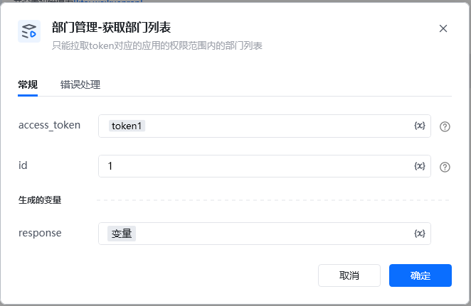
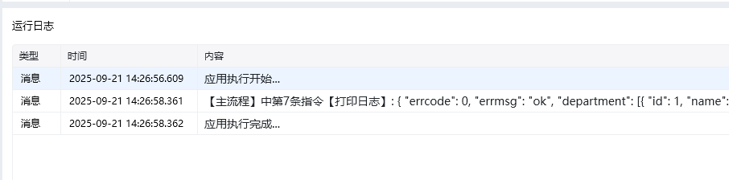

<strong>指令输入说明：</strong>

access_token:通过【初始化-获取access_token】指令获取参数

只能拉取token对应的应用的权限范围内的部门列表

id:获取指定部门及其下的子部门（以及子部门的子部门等等，递归）。

如果不填，默认获取全量组织架构

<Info>
  使用指令过程中遇到问题？前往 [八爪鱼RPA 开发者社区问答板块](https://rpa.bazhuayu.com/community/questions) 提问，获取官方与社区帮助。
</Info>
