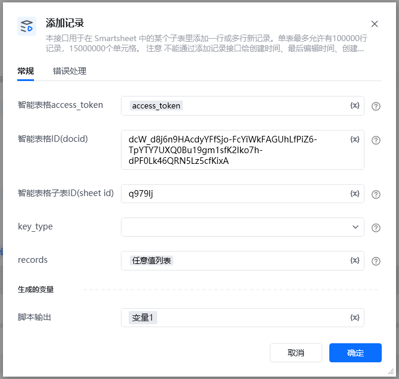
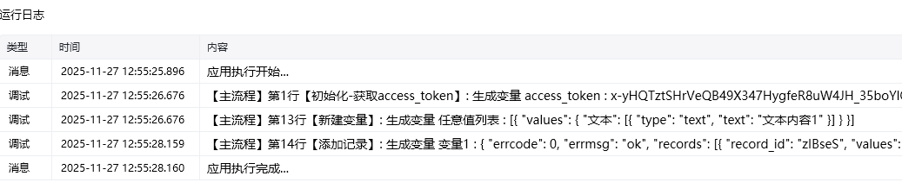
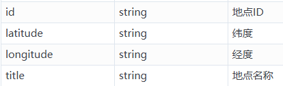
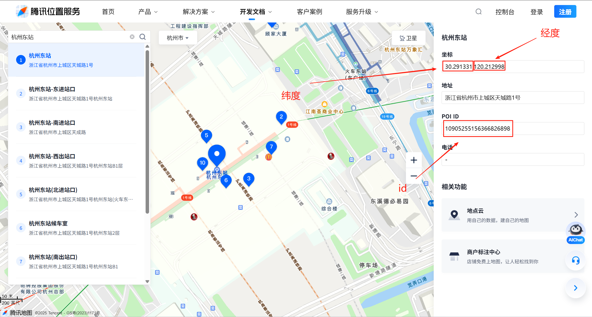

# 添加记录注意！！！
不能通过添加记录接口给文件、创建时间、最后编辑时间、创建人和最后编辑人五种类型的字段添加记录。

该指令旨在通过智能表格API添加记录
## 参数配置
### 指令输入
### 常规

<strong>智能表格access_token</strong>：通过指令【建立智能表格连接】获取

<strong>智能表格ID(docid)：</strong>字符串;可通过【新建智能表格】指令获取，注意新建表格后生成的docid要自己保存，后续遗忘无法找回

<strong>智能表格子表ID(sheet_id)：</strong>字符串;通过指令【查询子表】查找智能表格子表ID(sheet_id)

<strong>key_type：</strong>下拉框;key类型，默认用标题（key用字段标题表示）, 字段 ID （key用字段ID表示）

<strong>记录列表：</strong>任意值列表类型, 每个记录是一个字典，包含字段类型和对应的值

### 指令输出

<strong>响应内容</strong>：字典；返回响应内容

## 基础概念

<strong>关于字段节点结构详情请看 </strong><strong>添加记录</strong>[添加记录](https://developer.work.weixin.qq.com/document/path/99907)

<strong>文本类型：str, \{"文本": "内容"\}</strong>

<strong>数字类型：</strong>float， \{"数字": 123.0\}

<strong>复选框类型：</strong>bool， \{"复选框": True\}

<strong>日期时间类型：</strong>str，格式为 YYYY-MM-DD HH:mm:ss，\{"日期": "2025-10-01 12:00:00"\}

<strong>图片上传：</strong>str，上传图片地址，\{"图片"：r"D:\001.png"\}

<strong>成员类型：</strong>str，上传成员id，\{"成员"："xxxxx"\}

<strong>超链接类型：</strong>str，\{"超链接"："www.baidu.com"\}

<strong>电话或邮件类型：</strong>str，\{"电话": "1231231231123", "邮箱"："xxxxxxx"\}

<strong>单选或多选类型：</strong>str or list，当为字符串类型时是单选，为列表时是多选，当选项不存在时自动创建选项，\{"单选": "3","多选": ["2", "3"]\}

<strong>地理位置类型：</strong>dict，来源为腾讯地图。目前只支持腾讯地图来源，\{"地理位置"：\{"id": "10905255156366826898", "latitude": "30.291331", "longitude": "120.212998", "title": "杭州东站"\}\}

<strong>文件类型：</strong>参数名类型描述namestring文件名sizeint32文件大小file_extstring文件扩展名。文件夹为空，文件为对应文件拓展名，收集表为FORM，文档为DOC，表格为SHEET，幻灯片为SLIDE，思维导图为MIND，流程图为FLOWCHART，智能表为SMARTSHEETfile_idstring文件IDfile_urlstring文件url ，如果是微盘文档则通过获取分享链接[获取分享链接](https://developer.work.weixin.qq.com/document/path/99907#44667)获得，如果是文档，则为文档urlfile_typestring文件类型。文件夹为Folder，微盘文件为Wedrive，收集表为30，文档为50，表格是51，幻灯片为52，思维导图为54，流程图为55，智能表为70doc_typestring文件类型，用于区分文件夹和文件

\{    "文件": [        \{            "file_id": "s.ww8156d878fdf6f8d3.766540748uYa_f.766546853oWXD",            "name": "测试表格23.txt",             "size": 11131,            "file_type": "70",            "file_ext": "txt",            "doc_type": 2,            "file_url": "https://work.weixin.qq.com/wework_admin/frame#/wedrive/file/s.ww8156d878fdf6f8d3.766540748uYa_f.766546853oWXD"        \}    ]\}

可以在腾讯地图中获取（腾讯地图[腾讯地图](https://lbs.qq.com/getPoint/)）

### 记录列表例子

key用字段标题表示 \{    "名称1": "张三1",    "数字字段": 1213,    "图片": r"D:\00.jpg",    "日期时间": "2025-10-01 12:50:00",    "单选": "3",    "多选": ["2", "3"],    "成员": "lifei",    "邮箱": "123456789@qq.com",    "电话": "12345678901",    "复选框": true,    "链接": "https://www.example.com",     "地理位置": \{"id": "10905255156366826898", "latitude": "30.291331", "longitude": "120.212998", "title": "北京东站", "source_type": 1\}\}

<Info>
  使用指令过程中遇到问题？前往 [八爪鱼RPA 开发者社区问答板块](https://rpa.bazhuayu.com/community/questions) 提问，获取官方与社区帮助。
</Info>
