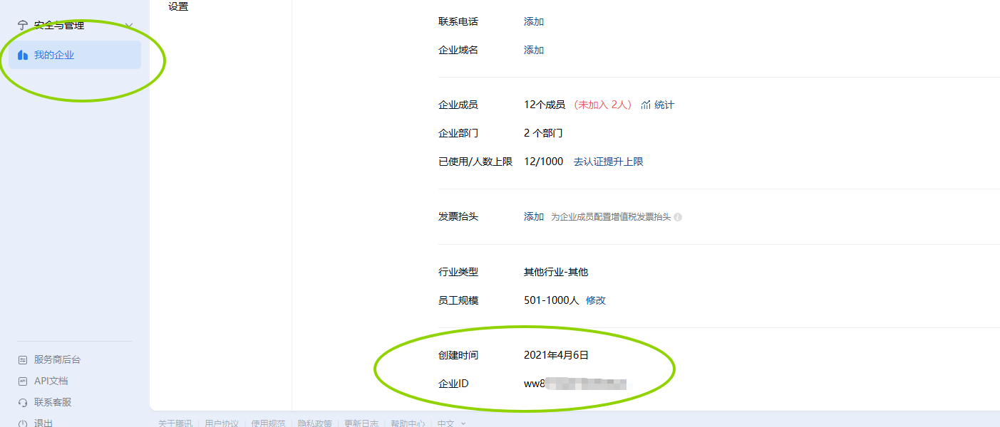
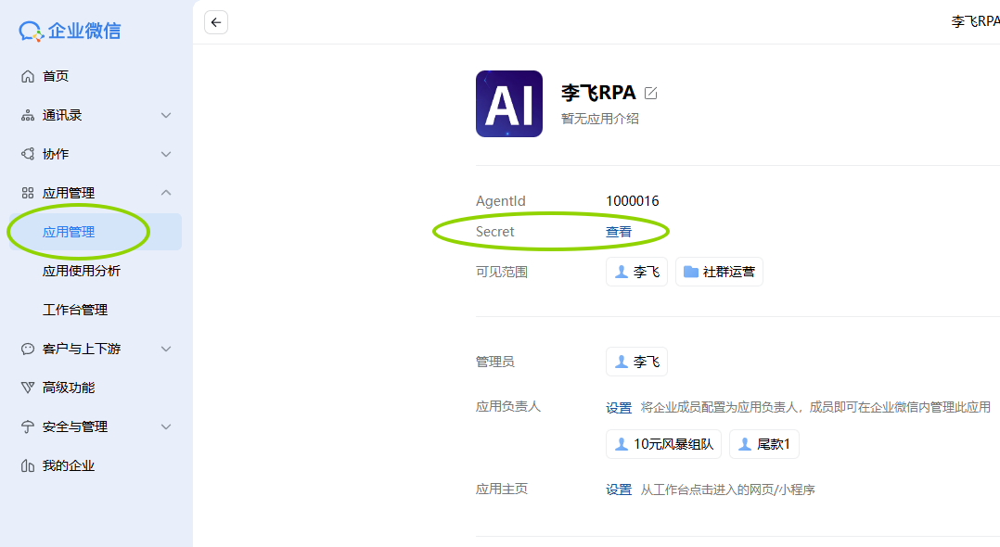
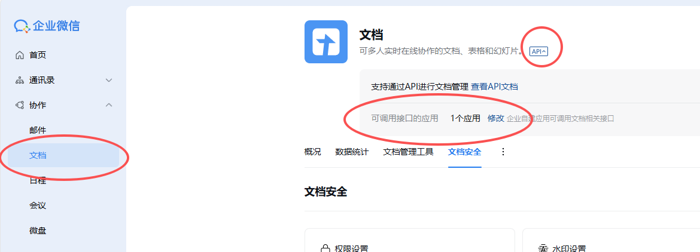
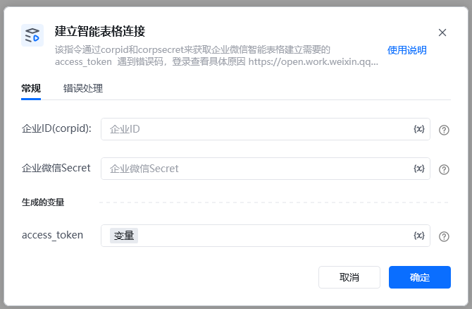
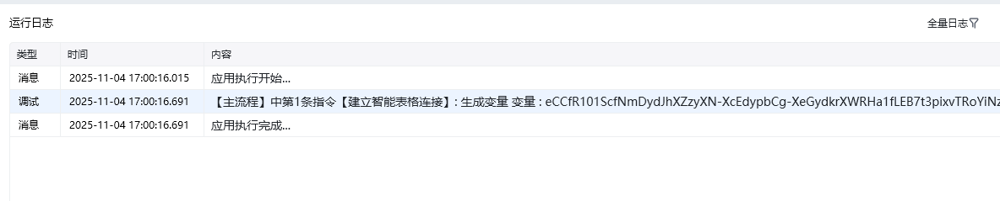

该指令通过corpid和corpsecret来与企业微信智能表格建立链接获取【智能表格access_token】
### 指令输入
### 常规

<strong>企业ID</strong>：字符串；企微应用的ID，获取方式见文档末尾

<strong>企业微信的Secret</strong>：字符串；企业微信的Secret

登录企业微信后台 https://work.weixin.qq.com/[https://work.weixin.qq.com/](https://work.weixin.qq.com/)

1.登录企业微信管理后台

进入「我的企业」→「企业信息」

查看并复制「企业ID」

3.选择 创建好的应用，获取 corpsecret

3.文档api设置，可调用接口的应用，否则没有权限

<Info>
  使用指令过程中遇到问题？前往 [八爪鱼RPA 开发者社区问答板块](https://rpa.bazhuayu.com/community/questions) 提问，获取官方与社区帮助。
</Info>
