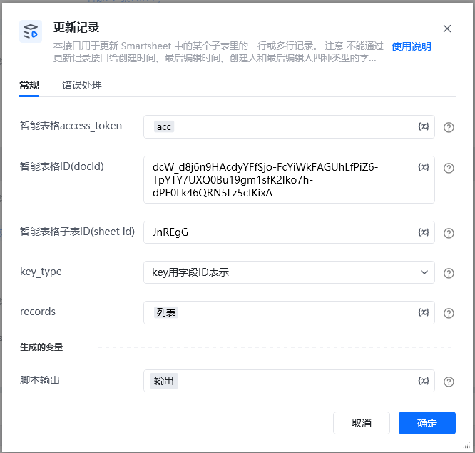
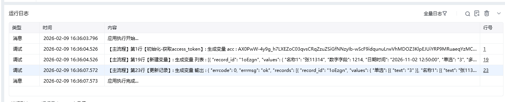

## 参数配置
### 指令输入
### 常规

<strong>智能表格access_token：</strong>通过指令【建立智能表格连接】获取

<strong>智能表格ID(docid)：</strong>字符串;可通过【新建智能表格】指令获取，注意新建表格后生成的docid要自己保存，后续遗忘无法找回

<strong>智能表格子表ID(sheet_id)</strong>：字符串;选填，默认查该表格所有子表选填，也可以通过指令【查询子表】查找指定子表ID(sheet_id)

<strong>records：</strong>数据类型：任意值列表可以查看以下写法：

<strong>record_id</strong>后面的值需要修改成实际的记录 ID，每个类型字段名称和表格里面名称要一致

可以通过在线表格里面，添加公式RECORD_ID()获取记录ID

\{

"record_id": "这里要修改对应的记录id",

"values": \{

"名称1": "张三111117",

"数字字段": 1214,

"图片": "D:\\通用图片.png",

"日期时间": "2025-10-01 12:50:00",

"单选": "3",

"多选": ["2", "3"],

"成员": "lifei",

"邮箱": "123456789@qq.com",

"电话": "12345678901",

"复选框": true,

"链接": "https://www.example.com",

"地理位置": \{

"id": "10905255156366826898",

"latitude": "30.291331",

"longitude": "120.212998",

"title": "北京123东站",

"source_type": 1

\},

"文件": [

\{

"file_id": "s.ww8156d878fdf6f8d3.766540748uYa_f.766546853oWXD",

"name": "测试表格23.txt",

"size": 11131,

"file_type": "70",

"file_ext": "txt",

"doc_type": 2,

"file_url": "https://work.weixin.qq.com/wework_admin/frame#/wedrive/file/s.ww8156d878fdf6f8d3.766540748uYa_f.766546853oWXD"

\}

]

\}

\}

CELL_VALUE_KEY_TYPE_FIELD_ID填写示例，和上面格式一样，只是把前面的名称替换成了FIELD_ID（可以使用指令【查询字段】，获取对应字段的id）record_id后面的值需要修改成实际的记录 ID\{

"record_id": "1oEzgn",

"values": \{

"fHTCT7": [

\{

"type": "text",

"text": "里侧"

\}

],

"fDsDxa": 1214,

"fJAwwb": "D:\\1.png",

"f2KZNy": "2025-11-11 12:50:00",

"fFILd7": [

\{

"text": "3"

\}

],

"fa1IAw": [

\{

"text": "2"

\},

\{

"text": "3"

\}

],

"fxH3Sn": [

\{

"user_id": "lifei"

\}

],

"fVRYTj": "123456789@qq.com",

"f0JfaH": [

\{

"file_id": "s.ww8156d878fdf6f8d3.766540748uYa_f.766546853oWXD",

"name": "测试表格23.txt",

"size": 11131,

"file_type": "70",

"file_ext": "txt",

"doc_type": 2,

"file_url": "https://work.weixin.qq.com/wework_admin/frame#/wedrive/file/s.ww8156d878fdf6f8d3.766540748uYa_f.766546853oWXD"

\}

],

"faugh2": "12345678901",

"fMcwvd": true,

"f8deke": [

\{

"link": "https://www.example.com",

"text": "https://www.example.com",

"type": "url"

\}

],

"fUrCOH": [

\{

"id": "10905255156366826898",

"latitude": "30.291331",

"longitude": "120.212998",

"title": "北京",

"source_type": 1

\}

]

\}

\}

<Info>
  使用指令过程中遇到问题？前往 [八爪鱼RPA 开发者社区问答板块](https://rpa.bazhuayu.com/community/questions) 提问，获取官方与社区帮助。
</Info>
