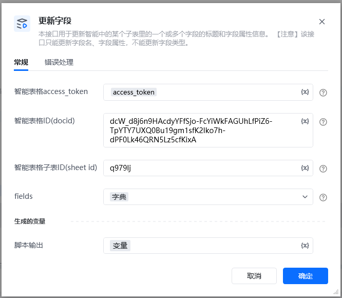
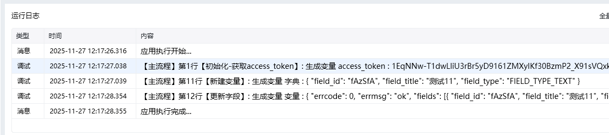

## 描述

该指令旨在通过智能表格API更新字段
## 参数配置
### 指令输入
### 常规

<strong>智能表格access_token：</strong>通过指令【建立智能表格连接】获取

<strong>智能表格ID(docid)：</strong>字符串;可通过【新建智能表格】指令获取，注意新建表格后生成的docid要自己保存，后续遗忘无法找回

<strong>智能表格子表ID(sheet_id)：</strong>字符串;通过指令【查询子表】查找智能表格子表ID(sheet_id)

<strong>字段列表：</strong>列表;字段列表, 每个字段是一个字典，任意值类型

### 指令输出

<strong>响应内容</strong>：字典；返回响应内容

代码参考 和指令【添加字段】格式一样，需要先通过【查询字段】查询到FIELD_ID

文本

\{

"field_id": "FIELD_ID",

"field_title": "文本字段",

"field_type": "FIELD_TYPE_TEXT"

\}

数字

\{

"field_id": "FIELD_ID",

"field_title": "数字字段",

"field_type": "FIELD_TYPE_NUMBER",

"property_number": \{

"decimal_places": 0,

"use_separate": true

\}

\}

复选框

\{

"field_id": "FIELD_ID",

"field_title": "复选框",

"field_type": "FIELD_TYPE_CHECKBOX"

\}

日期时间

\{

"field_id": "FIELD_ID",

"field_title": "日期时间",

"field_type": "FIELD_TYPE_DATE_TIME",

"property_date_time": \{

"format": "yyyy-mm-dd"

\}

\}

图片

\{

"field_id": "FIELD_ID",

"field_title": "图片",

"field_type": "FIELD_TYPE_IMAGE"

\}

文件

\{

"field_id": "FIELD_ID",

"field_title": "文件",

"field_type": "FIELD_TYPE_ATTACHMENT"

\}

成员

\{

"field_id": "FIELD_ID",

"field_title": "成员",

"field_type": "FIELD_TYPE_USER"

\}

多选

\{

"field_id": "FIELD_ID",

"field_title": "多选",

"field_type": "FIELD_TYPE_SELECT",

"property_select": \{

"options": [

\{"id": "opt1", "text": "选项A", "color": "BLUE"\},

\{"id": "opt2", "text": "选项B", "color": "RED"\}

]

\}

\}

创建人

\{

"field_id": "FIELD_ID",

"field_title": "创建人",

"field_type": "FIELD_TYPE_CREATED_USER"

\}

最后编辑人

\{

"field_id": "FIELD_ID",

"field_title": "最后编辑人",

"field_type": "FIELD_TYPE_MODIFIED_USER"

\}

创建时间

\{

"field_id": "FIELD_ID",

"field_title": "创建时间",

"field_type": "FIELD_TYPE_CREATED_TIME"

\}

最后编辑时间

\{

"field_id": "FIELD_ID",

"field_title": "最后编辑时间",

"field_type": "FIELD_TYPE_MODIFIED_TIME"

\}

电话

\{

"field_id": "FIELD_ID",

"field_title": "电话",

"field_type": "FIELD_TYPE_PHONE_NUMBER"

\}

邮件

\{

"field_id": "FIELD_ID",

"field_title": "邮件",

"field_type": "FIELD_TYPE_EMAIL"

\}

单选

\{

"field_id": "FIELD_ID",

"field_title": "单选111",

"field_type": "FIELD_TYPE_SINGLE_SELECT",

"property_single_select": \{

"options": [

\{"id": "opt_high", "text": "高", "style": 16\},

\{"id": "opt_low", "text": "低", "style": 18\}

]

\}

\}

超链接

\{

"field_id": "FIELD_ID",

"field_title": "超链接1",

"field_type": "FIELD_TYPE_URL",

"property_url": \{

"type": "LINK_TYPE_PURE_TEXT"

\}

\}

群

\{

"field_id": "FIELD_ID",

"field_title": "群",

"field_type": "FIELD_TYPE_WWGROUP"

\}

百分数

\{

"field_id": "FIELD_ID",

"field_title": "百分数",

"field_type": "FIELD_TYPE_PERCENTAGE",

"property_percentage": \{

"decimal_places": 2

\}

\}

条码

\{

"field_id": "FIELD_ID",

"field_title": "条码",

"field_type": "FIELD_TYPE_BARCODE"

\}

<Info>
  使用指令过程中遇到问题？前往 [八爪鱼RPA 开发者社区问答板块](https://rpa.bazhuayu.com/community/questions) 提问，获取官方与社区帮助。
</Info>
