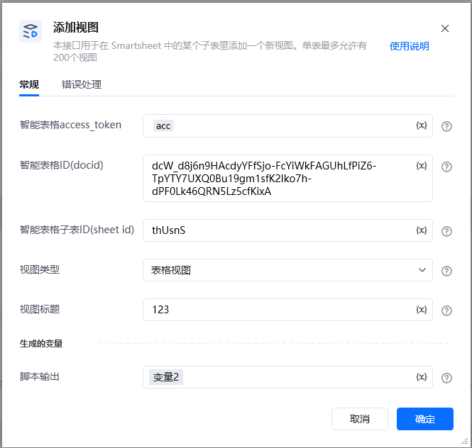
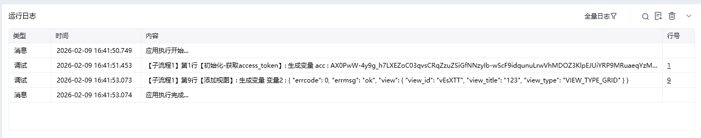

## 参数配置
### 指令输入
### 常规

<strong>智能表格access_token：</strong>通过指令【建立智能表格连接】获取

<strong>智能表格ID(docid)：</strong>字符串;可通过【新建智能表格】指令获取，注意新建表格后生成的docid要自己保存，后续遗忘无法找回

<strong>智能表格子表ID(sheet_id)</strong>：字符串;选填，默认查该表格所有子表选填，通过指令【查询子表】查找智能表格子表ID(sheet_id)

<strong>视图类型：</strong>下拉框;选择表格视图、看板视图、画册视图

<strong>视图标题：</strong>字符串;填写视图标题

### 指令输出

<strong>响应内容</strong>：字典；返回响应内容

<Info>
  使用指令过程中遇到问题？前往 [八爪鱼RPA 开发者社区问答板块](https://rpa.bazhuayu.com/community/questions) 提问，获取官方与社区帮助。
</Info>
